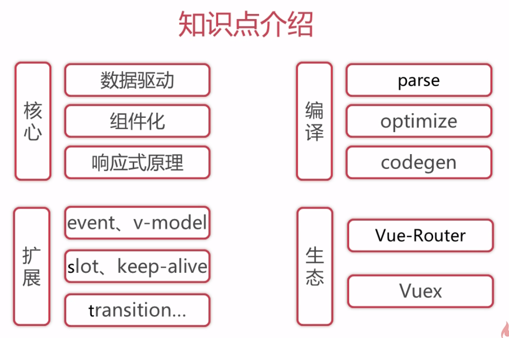

# 导学

## 知识点



flow libdef

vue src文件
compiler 编译
core 

入口文件
platforms/web/entry-runtime-with-compiler.js


使用es5的function而不是es6的class，vue将function原型上的方法拆分为单个模块（文件），依次挂载，class比较难实现


数据驱动  -> 数据如何映射到dom上的
深入响应式原理 -> 数据变化如何导致dom变化的


debugger时console是可以打印出当前上下文的变量的（即scope中）


代理data, methods, props中属性到vm上


mixin挂载了很多方法到Vue.prototype上


渲染watcher

vnode
watcher


问题
.vue文件通过webpack vue-loader编译成render函数，所以只需使用runtime-only版本
而template不会通过webpack编译。但是为什么不呢？


Vue的每层封装都做了什么?
$mount的每层封装做了什么?
  - web/entry-runtime-with-compiler.js 添加tpl转换为render函数的方法

_watcher
_watchers

render function不会像template一样先渲染{{message}}，再替换（不是.vue，是template）

hoc与其他到底有什么区别，如果将不是hoc的写成hoc呢？


platforms/web/entry-runtime-with-compiler -> platforms/web/runtime/index -> core/index -> instance/index


process.env.NODE_ENV !== 'production'是打包时是怎么去掉的？

_createElement  context children 注意context时Component类型， children时VNode数组


注意vnode实例和vue componet实例， Vue实例区别
_render createElement _update

为什么要normalizeChildren打平呢？？不就是树状的吗，不应该保持每层是平的数据就行了吗？?


_init只在new Vue时执行一次，_render, $mount执行多次

createPatchFunction 柯里化
先添加dom，再删除旧的dom


### 组件化

```
// render函数
render: h => h('div', 'hello, vue!')
// 组件化
render: h => h(App)
```
