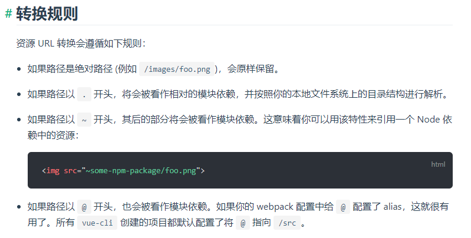
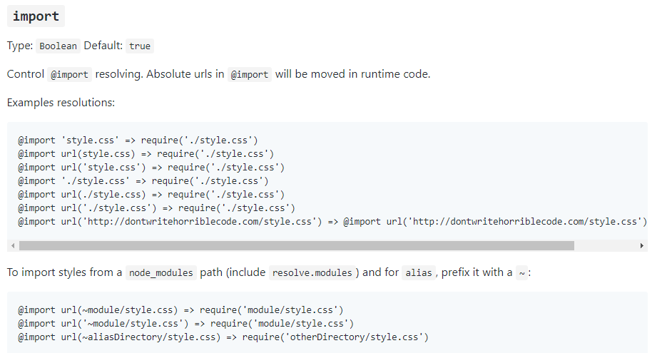

# 18-12-19 Vue使用小结

> 参考  
[Vue](https://cn.vuejs.org/v2/guide/)
[Vue Router](https://router.vuejs.org/zh/)
[Vuex](https://vuex.vuejs.org/zh/)
[Vue Loader](https://vue-loader.vuejs.org/zh/)
[Vue.js风格指南](https://cn.vuejs.org/v2/style-guide/)

## Vue

* 组件顶层元素不要使用ID选择器  
* template中用不到的数据，不要写在data中，比如定时器的timer (可以以注释的形式写在data中，方便知道this上都有哪些变量)  
  
## Vue Router

### 1. 编程式导航传参方式

* 通常，我会使用带查询参数的这种，因为params虽然可以使url优雅一些，但不将参数保存在本地的话的就不支持刷新操作了
* 路由参数获取的操作最好在beforeRouteEnter，beforeRouteLeave等hook中完成，而不是直接使用$route。使用$route时，触发beforeRouteUpdate时，$route的获取的参数值是不会变化的
* 在改变url中参数而不改变路由指向的组件时，会触发beforeRouteUpdate。所以，一般在带参数的组件中，在beforeRouteEnter， beforeRouteUpdate中最好都写上相应的获取参数逻辑

```js
// Vue Router传参方式
// 注意name和params搭配，path和query搭配

// 命名的路由，url不会体现params
router.push({ name: 'user', params: { userId: 123 }})
// 带查询参数，变成 /register?plan=private
router.push({ path: 'register', query: { plan: 'private' }})
// 参数匹配
// 在routes中先配好匹配的路由`{ path: '/user/:id', component: User }`, 然后从to.params.id中取值
router.push({ path: `/user/${userId}` })
```

### 2. location.search/hash和to.query/params

:::tip
文章中`location.search` === `query` !== `to.query`
:::

通常，我使用的是hash路由，传参方式也是使用`{path: '/', query: {a: 1, b: 2}}`这样类似query可以体现在url中的方式，不过这和浏览器原生的query是不一样的:  

1. href中放在`#`后面的都作为hash，所以`#`后面出现的`?`query也是hash的一部分(优先级高于第2条)
2. href中`?`后面的`#`前面的部分作为`location.search`  
3. 不过location.search也是有优点的，有时url中需要携带每个路由都能获取到了query  
例：假设后台生成一个url`http://abc.com?userId=1&password=2`需要自动登录，所以此时hash路由一定时加载query后面的，比如`http://abc.com?userId=1&password=2#/`，此时，通过`to.query`就无能为力了，需要自己解析`location.search`

例：`http://localhost:8082/mobile.html?a=1&b=2#/cameras?c=3&d=4`

```js
// 在beforeRouteEnter中 console的一些信息
to.query = '{"c":"3","d":"4"}'      // hash`#`后的`?`
to.params = '{}'                    // 不是路由匹配的情况时，url中不会体现
location.search = '?a=1&b=2'        // `?`后`#`前的query
location.hash = '#/cameras?c=3&d=4' // `#`后面的所有
```

## Vuex

* 同一份数据，在不同组件中可能有很多中需求，比如1.需要实时更新 2.首次请求到的即可，最好在vuex中定义多个变量，指代不同的需求，不然会增加无谓的渲染

## Vue Loader

### 1. 资源路径

经常遇到引用资源的方式，js中的最好理解，webpack中配过对应的alias即可使用，如下1，4  
其他则会使用`~`来表示后面的路径是alias或者npm package中的资源，包括scss的@import，css中的资源路径，template中的资源路径，这是多个loader共同作用的结果  

* [Vue Loader - 处理资源路径](https://vue-loader.vuejs.org/zh/guide/asset-url.html#%E8%BD%AC%E6%8D%A2%E8%A7%84%E5%88%99)  

对如下2，3起作用，具体截图如下：



* [css-loader - import](https://github.com/webpack-contrib/css-loader#import)

对如下5，6起作用，具体截图如下：

> The css-loader interprets @import and url() like import/require() and will resolve them.



```vue
<template>
  <div>
    <!-- 1 -->
    
    <!-- 2 -->
    
    <!-- 3 -->
    
  </div>
</template>

<script>
  // 4
  import ICON from 'common/test.png'
</script>

<style lang="scss">
  // 5
  @import '~common/scss/index.scss';

  body{
    // 6
    background: url('~common/img/login-left-bg.jpg') no-repeat center/cover;
  }
</style>
```
