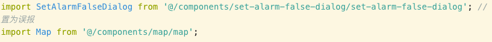

# 开发小结

## 编码习惯

* 注释最好不要写在一行代码的末尾，在小屏上这行可能会折行，看起来像是后面一行代码的注释
  

* 约定的东西就要遵守，比如webpack中配置了alias，就要优先使用，而不是前后风格不一致

## js

* 添加或传输表单，url数据时的encodeURIComponent, decodeURIComponent，表单的trim (比如你输入了一个emoji，不encode的话，可能后台都没有处理特殊字符，这时候接口就返回失败了)
* `try {} catch(e) {}`的使用，一直没有用过`try...catch`，现在`JSON.parse()`或者`async await`时需要使用

## css

* 注意文字很长和很短时的显示是否正常
* 动画中，禁止使用百分比，transform: translate3d(100%, 0, 0)，使用vw或者固定数值，否则多数情况下动画会非常卡顿

## 测试

* 某个组件根据数组长度，显示个数，要测试数据非常多的情况
* 测试网速很慢情况下的页面，可以暴露很多问题，比如一些渲染时机的选择错误等。

## 其他

* 很多图片在pending状态，会导致页面卡死 (接口也是一样)  
项目中使用了websocket推送摄像头图片地址，太过频繁，下载的速度跟不上推送的速度，导致页面卡死
