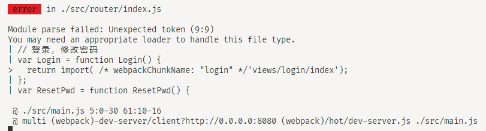

# 19-02-22 vue-cli2升级至webpack4.x

> 参考  
1.[webpack v4.0.0-beta.0 release notes](https://github.com/webpack/webpack/releases/tag/v4.0.0-beta.00)  
2.[webpack 4: released today!! - Sean T. Larkin - medium](https://medium.com/webpack/webpack-4-released-today-6cdb994702d4)  
3.[RIP CommonsChunkPlugin](https://gist.github.com/sokra/1522d586b8e5c0f5072d7565c2bee693)

[[toc]]

webpack在2018年2月正式进入4.x版本，速度的提升是它的一大亮点。现在已经是2019年2月了，webpack5.x即将发布，我还是麻溜点用起来。
本文只涉及vue-cli2中webpack的升级，具体配置请参考[webpack文档](https://webpack.js.org)

:::tip
1. 升级之后当天测试不管是build还是dev速度都是变慢的？但第二天测试发现速度又变快了？？
2. webpack文档依旧很不好，旧版新版内容混杂在一起，很不利于学习，比如CommonsChunkPlugin还没删除
:::

## webpack 4与本文相关的changes
1. 添加mode(production, development, none)。development默认开启错误提示，提升重新编译的速度；production默认开启各种优化压缩（如uglifyJs, splitChunks）
2. 构建后文件的优化如压缩,chunk拆分等配置移入optimization.*对应选项中
3. 删除CommonsChunkPlugin，增加optimization.splitChunks配置
4. 新的插件系统导致基本所有plugin都要更新版本

## webpack 3.x -> 4.x

1. 升级devDependencies
```git
"devDependencies": {
-    "autoprefixer": "^7.1.2",
+    "autoprefixer": "^9.4.7",
-    "extract-text-webpack-plugin": "^3.0.0",
-    "html-webpack-plugin": "^2.30.1",
+    "html-webpack-plugin": "^3.2.0",
+    "mini-css-extract-plugin": "^0.5.0",
-    "optimize-css-assets-webpack-plugin": "^3.2.0",
+    "optimize-css-assets-webpack-plugin": "^5.0.1",
-    "uglifyjs-webpack-plugin": "^1.1.1",
-    "url-loader": "^0.5.8",
-    "vue-loader": "^13.3.0",
-    "vue-style-loader": "^3.0.1",
+    "uglifyjs-webpack-plugin": "^1.3.0",
+    "url-loader": "^1.1.2",
+    "vue-loader": "^14.2.2",
+    "vue-style-loader": "^4.1.2",
-    "webpack": "^3.6.0",
-    "webpack-bundle-analyzer": "^2.9.0",
-    "webpack-dev-server": "^2.9.1",
-    "webpack-merge": "^4.1.0"
+    "webpack": "4.28.4",
+    "webpack-bundle-analyzer": "^3.0.4",
+    "webpack-cli": "^3.2.3",
+    "webpack-dev-server": "^3.1.14",
+    "webpack-merge": "^4.1.4"
},
```

2.修改配置

webpack4新增[mode](https://webpack.js.org/concepts/mode/)，有几个默认选项development, production(默认), none(去除默认配置)，在其中加入了一些预设配置，所以可以删除3.x中一些需要手动配置的插件

production模式也会自动开启SplitChunksPlugin，如果我们以前使用CommonsChunkPlugin添加了一些分拆大的库的配置，那么现在我们可以完全不配置optimization.splitChunks了，SplitChunksPlugin会默认自动分拆大于30kb的包

webpack.base.conf.js
```git
module.exports = {
+  mode: process.env.NODE_ENV === 'production' ? 'production' : 'development',
}
```

webpack.dev.conf.js
```git
plugins: [
   // development默认开启
-  new webpack.NamedModulesPlugin(), // HMR shows correct file names in console on update.
   new webpack.NoEmitOnErrorsPlugin(),
   new HtmlWebpackPlugin({
    // 见问题2
+    chunksSortMode: 'none'
   }),
]
```

webpack.prod.conf.js  
- 删除CommonsChunkPlugin的所有配置，在optimization中新增splitChunks和runtimeChunk
- 将压缩插件移入optimization.minimizer
- ExtractTextPlugin替换为MiniCssExtractPlugin(官方推荐，非必须，ExtractTextPlugin@next也可以使用)(不过暂时还没找到方法像ExtractTextPlugin将.vue文件的css打包在一起的方法，现在是每个路由组件会打包出一个.css，不好)

```git
- const ExtractTextPlugin = require('extract-text-webpack-plugin')
+ const MiniCssExtractPlugin = require('mini-css-extract-plugin')

  const webpackConfig = merge(baseWebpackConfig, {
    // 非必要
+   performance: {
+     hints: false
+   },
    plugins: [
-     // extract css into its own file
-     new ExtractTextPlugin({
-       filename: utils.assetsPath('css/[name].[contenthash].css'),
-       // Setting the following option to `false` will not extract CSS from codesplit chunks.
-       // Their CSS will instead be inserted dynamically with style-loader when the codesplit chunk has been loaded by webpack.
-       // It's currently set to `true` because we are seeing that sourcemaps are included in the codesplit bundle as well when it's `false`, 
-       // increasing file size: https://github.com/vuejs-templates/webpack/issues/1110
-       allChunks: true,
-     }),
+     new MiniCssExtractPlugin({
+       filename: utils.assetsPath('css/[name].css'),
+       chunkFilename: utils.assetsPath('css/[name].[contenthash].css')
+     }),
      new HtmlWebpackPlugin({
        // 见问题2
+       chunksSortMode: 'none',
      }),
      // production默认开启
-     new webpack.optimize.ModuleConcatenationPlugin(),
      // 从原来的plugins选项移入optimization.minimizer
-     new OptimizeCSSPlugin({
-       cssProcessorOptions: config.build.productionSourceMap
-         ? { safe: true, map: { inline: false } }
-         : { safe: true }
-     }),
      // 从原来的plugins选项移入optimization.minimizer
-     new UglifyJsPlugin({
-       uglifyOptions: {
-         compress: {
-           warnings: false,
-           drop_console: true,
-           collapse_vars: true,
-           reduce_vars: true,
-         },
-         output: {
-           beautify: false,
-           comments: false,
-         }
-       },
-       sourceMap: config.build.productionSourceMap,
-       parallel: true,
-       cache: true
-     }),
      // 删除以下CommonsChunkPlugin的配置
-     new webpack.optimize.CommonsChunkPlugin({
-       name: 'vendor',
-       minChunks (module) {
-         // any required modules inside node_modules are extracted to vendor
-         return (
-           module.resource &&
-           /\.js$/.test(module.resource) &&
-           module.resource.indexOf(
-             path.join(__dirname, '../node_modules')
-           ) === 0
-         )
-       }
-     }),
-     // extract webpack runtime and module manifest to its own file in order to
-     // prevent vendor hash from being updated whenever app bundle is updated
-     new webpack.optimize.CommonsChunkPlugin({
-       name: 'manifest',
-       minChunks: Infinity
-     }),
-     // This instance extracts shared chunks from code splitted chunks and bundles them
-     // in a separate chunk, similar to the vendor chunk
-     // see: https://webpack.js.org/plugins/commons-chunk-plugin/#extra-async-commons-chunk
-     new webpack.optimize.CommonsChunkPlugin({
-       name: 'app',
-       async: 'vendor-async',
-       children: true,
-       minChunks: function(module, count) { 
-         return module.resource && !(/echarts|zrender|xlsx|file-saver/.test(module.resource)) && count >= 2
-       }
-       // minChunks: 2
-     }),
-     new webpack.optimize.CommonsChunkPlugin({
-       name: 'app',
-       async: 'echarts',
-       children: true,
-       minChunks: function(module, count) {
-         return module.resource && /echarts|zrender/.test(module.resource) && count >= 2
-       }
-     }),
-     new webpack.optimize.CommonsChunkPlugin({
-       name: 'app',
-       async: 'xlsx',
-       children: true,
-       minChunks: function(module, count) {
-         return module.resource && /xlsx|file-saver/.test(module.resource) && count >= 2
-       }
-     }),
    ],
+   optimization: {
+     runtimeChunk: {
+       name: 'wcare-manifest'
+     },
+     splitChunks: {
+
+     },
+     minimizer: [
+       new UglifyJsPlugin({
+         uglifyOptions: {
+           compress: {
+             warnings: false,
+             drop_console: true,
+             collapse_vars: true,
+             reduce_vars: true,
+           },
+           output: {
+             beautify: false,
+             comments: false,
+           }
+         },
+         sourceMap: config.build.productionSourceMap,
+         parallel: true,
+         cache: true
+       }),
+       new OptimizeCSSPlugin({
+         cssProcessorOptions: config.build.productionSourceMap
+           ? { safe: true, map: { inline: false } }
+           : { safe: true }
+       }),
+     ],
+   }
  }

```

### 问题

遇到的问题基本都能在webpack或者触发问题的库的issues中找到解决方案

1. [dynamic import fails](https://github.com/webpack/webpack/issues/8656)  
解决：webpack从4.29.x降级到4.28.4


2. [HtmlWebpackPlugin引用的toposort库抛错](https://github.com/jantimon/html-webpack-plugin/issues/870)
解决：HtmlWebpackPlugin的配置中修改chunksSortMode: 'none'


3. 其他问题  
解决：删除node_modules，package-lock.json，重新安装


