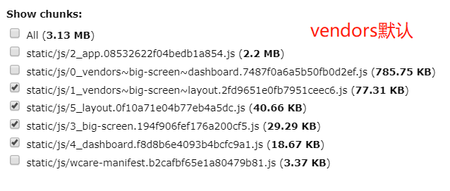

# 19-02-22 webpack splitchunks试验

parcel

> 参考  
1.[手摸手，带你用合理的姿势使用webpack4（下）](https://juejin.im/post/5b5d6d6f6fb9a04fea58aabc)  
2.[一步一步的了解webpack4的splitChunk插件](https://juejin.im/post/5af1677c6fb9a07ab508dabb)  
3.[SplitChunksPlugin](https://webpack.js.org/plugins/split-chunks-plugin)

low:  
1.[webpack 4 Code Splitting 的 splitChunks 配置探索](https://imweb.io/topic/5b66dd601402769b60847149)  
2.[webpack 4: Code Splitting, chunk graph and the splitChunks optimization](https://medium.com/webpack/webpack-4-code-splitting-chunk-graph-and-the-splitchunks-optimization-be739a861366)  

本文针对的是vue的单页应用splitChunks测试

webpack4.x新增的SplitChunksPlugin对默认情况下chunk的拆分做了很多优化

1.只保留几个标志性页面
login, layout, big-screen, alarm-detail, dashboard, img-hostory, camera-detail, admin-cams, check-item


|页面|共有依赖|大小|
|:-:|:-:|:-:|
|big-screen, layout| stomp | > 30kb |
|camera-detail|cam-info-form, set-alarm-dialog, set-rain-mode-dialog..|< 30kb |
|alarm-detail |send-sms-dialog, btn-group, set-alarm-false, set-alarm-true | < 30kb |
|admin-cams|cam-info-form.vue| < 30kb |
|big-screen, dashboard, img-history|date-fns| 30.44kb |
|check-item|sortablejs| < 30kb |

## 规则
> New chunk can be shared OR modules are from the node_modules folder  
New chunk would be bigger than 30kb (before min+gz)  
Maximum number of parallel requests when loading chunks on demand would be lower or equal to 5  
Maximum number of parallel requests at initial page load would be lower or equal to 3  

## 默认配置
```js
splitChunks: {
  chunks: 'async',
  minSize: 30000,
  maxSize: 0,
  minChunks: 1,
  maxAsyncRequests: 5,
  maxInitialRequests: 3,
  automaticNameDelimiter: '~',
  name: true,
  cacheGroups: {
    vendors: {
      test: /[\\/]node_modules[\\/]/,
      priority: -10
    },
    default: {
      minChunks: 2,
      priority: -20,
      reuseExistingChunk: true
    }
  }
}
```
看看vendors和default分别的作用
<!-- 默认 [report](./report/report-default.html)
default: false [report](./report/report-default-false.html) 与默认是一样的，这个应该对多页才有效
vendors: false [report](./report/report-vendors-false.html) -->
false之后，node_modules中的文件就和业务文件公共chunk打包在一起了
1. 名称变化


2. 默认vendors中big-screen和layout中各有一个time-count  
vendors: false中只有一个有time-count 1_default~big-screen~layout

## minSize
minSize是针对依赖原始大小（before min+gz & 模块化引入），如date-fns是针对其原始大小（172.23kb）
|node_module name|Stat size|Parsed size|
|:-:|:-:|:-:|
|date-fns | 172.23kb| 30.44kb |


测试  
minSize: 170000 拆分出公共chunk

minSize: 180000 每个路由重复打包


## name
If the splitChunks.name matches an entry point name, the entry point will be removed

## chunks
只针对选中的模块进行拆分的优化
```
// 选项
initial: 只对首次就加载的模块    
async: 只针对动态加载的模块  
all: 所有模块  
funtion: return true的模块  -> 比较适合去掉大屏页的依赖
```

假设vue-router中的路由是以动态加载的形式引入，打包时这个组件就是会被拆分为单独js文件的异步组件，chunks: 'async'针对这些异步组件打包优化
```js
const Login = () => import(/* webpackChunkName: "login" */ 'views/login/index')
```
假设vue-rotuer中的路由是以下面同步方式引入，打包时整个单页就是一个js，此时`chunks: 'async'`并不会拆分出任何chunk。此时如果设置`chunks: 'initial' | 'all'`则会抽出node_modules中的模块

```js
import Login from 'views/login/index'
```

## name
:::warning
When assigning equal names to different split chunks, all vendor modules are placed into a single shared chunk, though it's not recommend since it can result in more code downloaded.
:::

```
true: based on chunks and cache group key，如单独拆出date-fns，包含这个module的chunk有app(initial chunk)，则名如date-fns~app.js
```

:::tip
maxSize takes higher priority than maxInitialRequest/maxAsyncRequests. Actual priority is maxInitialRequest/maxAsyncRequests < maxSize < minSize.
:::

## 测试

:::tip
以下配置均在默认配置之后修改
:::

---
```js
// 并没有exclude掉
// 还是app, vendor, big-screen，并且screen中没有node_modules依赖??
chunks(chunk) {
  console.log(chunk.name)
  return chunk.name !== 'big-screen'
}
```


---
```js
// 还是app, vendor, big-screen，并且screen中没有node_modules依赖??
chunks(chunk) {
  console.log(chunk.name)
  return chunk.name !== 'app'
}
```


---
```js
// 加了一个dashboard动态import, echarts是单独打包了，但是date-fns, stompjs还是在vendor中，猜测是vendor-app这个原始的vendor是一定被共用的，只有除此之外的包，被exclude的包才不会引用出vendor-app之外的包，而是打包到自己里面。
// 但是为什么只有echarts拆出来了呢？因为app页面没有用到？
chunks(chunk) {
  return chunk.name !== 'big-screen'
}
```


--- 
```js
// 如果加一个layout(包含date-fns)的动态import，如果date-fns, stompjs在layout和big-screen都打了包说明上一个注释结论正确（即initial打包的module始终会被共享，而非initial的包才会有共不共享这一说）
// 结论：stompjs是分别直接引入layout和big-screen后使用的，所以是单独打包了。而date-fns是写了一个通用组件之后引入到这两个页面的所以最终还是打包在vender-app中
chunks(chunk) {
  return chunk.name !== 'big-screen'
}
```


---
```js
// 此时单独打包出date-fns（从vendor-app中拆出），此时的chunks exclude是没有作用的
chunks(chunk) {
  return chunk.name !== 'big-screen'
},
cacheGroups: {
  'date-fns': {
    test: /[\\/]node_modules[\\/]date-fns[\\/]/,
    priority: 1
  },
}
```

---
```js
// 看echarts这个不包含在vendor-app中的能否拆出公共包
// 结论：这时chunks的exclude起作用了，cacheGroup 'echarts'只对dashboard有作用，打包出的文件名可看出echarts~dashboard，而big-screen中的还是打包了echarts
chunks(chunk) {
  return chunk.name !== 'big-screen'
},
cacheGroups: {
  'echarts': {
    test: /[\\/]node_modules[\\/](echarts|zrender)[\\/]/,
    priority: 1
  },
}
```


reuseExistingChunk 与 priority 与 enforce？

```js
// 基础
vendors: {
  test: /[\\/]node_modules[\\/]/,
  priority: -10
},

```
```
// 可以拆开
'date-fns': {
  test: /[\\/]node_modules[\\/]date-fns[\\/]/,
  priority: -9,
},
```
**enforce**
> Tells webpack to ignore splitChunks.minSize, splitChunks.minChunks, splitChunks.maxAsyncRequests and splitChunks.maxInitialRequests options and always create chunks for this cache group.
```
// 不能拆开
'date-fns': {
  test: /[\\/]node_modules[\\/]date-fns[\\/]/,
  priority: -11,
  enforce: true
},
```
```
// 不能拆开
'date-fns': {
  test: /[\\/]node_modules[\\/]date-fns[\\/]/,
  priority: -11,
  enforce: true, 
  reuseExistingChunk: false
},
```
