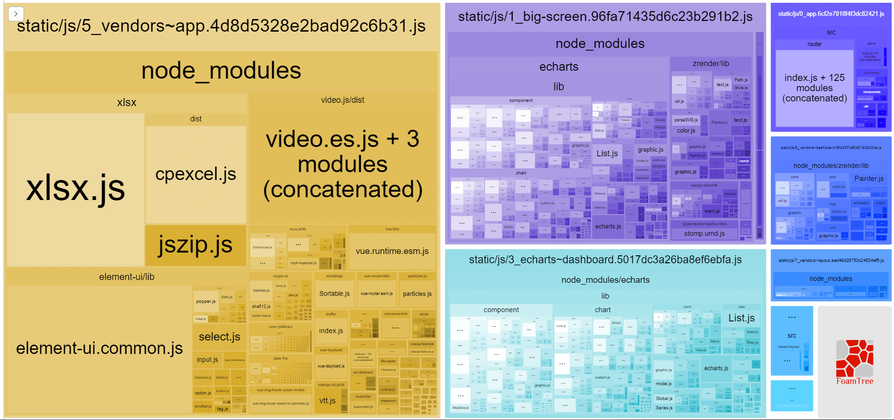

# 19-02-25 webpack splitchunks试验

> 参考  
1.[手摸手，带你用合理的姿势使用webpack4（下）](https://juejin.im/post/5b5d6d6f6fb9a04fea58aabc)  
2.[一步一步的了解webpack4的splitChunk插件](https://juejin.im/post/5af1677c6fb9a07ab508dabb)  
3.[SplitChunksPlugin](https://webpack.js.org/plugins/split-chunks-plugin)  
4.[webpack 4 Code Splitting 的 splitChunks 配置探索](https://imweb.io/topic/5b66dd601402769b60847149):dash:  
5.[webpack 4: Code Splitting, chunk graph and the splitChunks optimization](https://medium.com/webpack/webpack-4-code-splitting-chunk-graph-and-the-splitchunks-optimization-be739a861366):dash:  

:::warning TODO
搜索  
:question: -> 问题  
:dash: -> 待删除
:::

:::tip
本文针对vue单页应用进行测试
:::

[[toc]]

webpack4.x新增的SplitChunksPlugin对默认情况下chunk的拆分做了很多优化

## 测试1

:::tip splitChunks默认拆包情形  
- New chunk can be shared OR modules are from the node_modules folder  
- New chunk would be bigger than 30kb (before min+gz)  
- Maximum number of parallel requests when loading chunks on demand would be lower or equal to 5  
- Maximum number of parallel requests at initial page load would be lower or equal to 3  
:::

### splitChunks默认配置
```js
splitChunks: {
  chunks: 'async',
  minSize: 30000,
  maxSize: 0,
  minChunks: 1,
  maxAsyncRequests: 5,
  maxInitialRequests: 3,
  automaticNameDelimiter: '~',
  name: true,
  cacheGroups: {
    vendors: {
      test: /[\\/]node_modules[\\/]/,
      priority: -10
    },
    default: {
      minChunks: 2,
      priority: -20,
      reuseExistingChunk: true
    }
  }
}
```

### 页面介绍

|页面|公共依赖|依赖类型|原始大小|
|:-:|:-:|:-:|:-:|
|big-screen, layout| @stomp/stompjs, sockjs-client |node_modules| > 30kb |
|big-screen, dashboard, img-history|date-fns|node_modules| > 30kb |
|camera-detail, alarm-detail | set-alarm-dialog, set-rain-mode-dialog..|公共组件| < 30kb |
|camera-dtail, admin-cams | cam-info-form.vue |公共组件| < 30kb |
|check-item|sortablejs|node_modules| < 30kb |

### 默认配置作用

前提：针对layout, big-screen, dashboard三个路由进行测试

默认
<!-- [report](./report/report-default.html) -->


default: false -> 与默认是一样的，这个应该对多页才有效 :question:
<!-- [report](./report/report-default-false.html) -->

vendors: false -> node_modules中的文件就和业务文件公共chunk打包在一起了
<!-- [report](./report/report-vendors-false.html) -->

1. 名称变化  


2. 包含文件变化  

|配置|打包结果|理解|
|:-:|:-:|:-:|
|vendors默认|big-screen和layout中各有一个time-count组件|vendors默认配置拆分出来的包为node_modules中的，与time-count没有可合并的关系，所以只有time-count自身>30kb才能单独拆分|
|vendors: false|1_default~big-screen~layout包含有time-count组件|只有default的默认配置，即有2个chunk用到的>30kb的公共部分拆分出来。首先entry(app)一个，三个路由各一个，按default规则找出dashboard、big-screen中的echarts一个，big-screen、layout公共部分一个。其中time-count也是big-screen、layout的公共部分（已经被拆出的公共部分>30kb），所以就移到了公共部分中|

**发现**：一个路由不管引入多少组件，vendors看到的是所有组件的依赖，而不是组件的子组件的依赖，比如time-count被layout和big-screen依赖，而date-fns被time-count依赖，最终webpack看到的是layout和big-screen依赖date-fns:question:   


### splitChunks.minSize
针对依赖原始大小（before min+gz & 模块化引入），如date-fns是针对其原始大小（172.23kb）
|node_module name|Stat size|Parsed size|
|:-:|:-:|:-:|
|date-fns | 172.23kb| 30.44kb |

#### 测试
- minSize: 170000 拆分出公共chunk

- minSize: 180000 每个路由重复打包


### splitChunks.chunks
只针对选中的模块进行拆分的优化
```markdown
// chunks属性值
initial: 只优化首次就加载的chunks，如app.js  
async: 只优化动态加载的chunks，如vue中的路由组件
all: 所有chunks  
funtion: return true的模块  -> // 比较适合去掉大屏页的依赖:dash:
```

假设vue-router中的路由是以动态加载的形式引入，打包时这个组件就是会被拆分为单独js文件的异步组件，chunks: 'async'只针对这些异步组件打包优化。即如果App.vue和dashboard.vue同时引用了echarts，那么echarts肯定被打包到app.js中，而不会单独拆分。当然echarts也不会被打包多次。
```js
const Login = () => import(/* webpackChunkName: "login" */ 'views/login/index')
```

假设vue-rotuer中的路由是以下面同步方式引入，打包时整个单页就是一个js，此时`chunks: 'async'就毫无作用`。此时如果设置`chunks: 'initial' | 'all'`则可以拆出node_modules中的模块(默认vendors配置下)
```js
import Login from 'views/login/index'
```

### splitChunks.name

```
// name属性值
false -> 继承output中的chunkFilename选项
true -> based on chunks and cache group key // 如单独拆出date-fns，包含这个module的chunk有app(initial chunk)，则名如date-fns~app.js
function (module, chunks, cacheGroupKey)
string
```

:::tip 文档
- If the splitChunks.name matches an entry point name, the entry point will be removed
- When assigning equal names to different split chunks, all vendor modules are placed into a single shared chunk, though it's not recommend since it can result in more code downloaded.
:::

:::tip
maxSize takes higher priority than maxInitialRequest/maxAsyncRequests. Actual priority is maxInitialRequest/maxAsyncRequests < maxSize < minSize.
:::

### splitChunks.cacheGroups.{cacheGroup}.enforce & .reuseExistingChunk

:::tip 文档
- Tells webpack to ignore splitChunks.minSize, splitChunks.minChunks, splitChunks.maxAsyncRequests and splitChunks.maxInitialRequests options and always create chunks for this cache group.
:::
:::tip 默认
- app.js中同步组件ImageHistory依赖date-fns
- 动态加载组件layout和dashboard依赖date-fns
- 未写全的配置均为默认值
:::

所以priority优先级最高

```js
// 可以拆开(vendors默认为-10)
'date-fns': {
  test: /[\\/]node_modules[\\/]date-fns[\\/]/,
  priority: -9,
},
------
// 可以拆开 -> 我猜是因为priority没写为0的缘故
'date-fns': {
  test: /[\\/]node_modules[\\/]date-fns[\\/]/,
  enforce: true
},
```

```js
// 不能拆开
'date-fns': {
  test: /[\\/]node_modules[\\/]date-fns[\\/]/,
  priority: -11,
  enforce: true
}
------
// 不能拆开
'date-fns': {
  test: /[\\/]node_modules[\\/]date-fns[\\/]/,
  priority: -11,
  enforce: true, 
  reuseExistingChunk: false
},
```

```js
// 此时date-fns被拆分出来，但是big-screen中没有date-fns，并且vendor-app中也没有？？打包出的文件名是date-fns-app.js？？
chunks(chunk) {
  return chunk.name !== 'big-screen'
},
cacheGroups: {
  vendors: {
    test: /[\\/]node_modules[\\/]/,
    priority: -10,
    reuseExistingChunk: false
  },
  'date-fns': {
    test: /[\\/]node_modules[\\/]date-fns[\\/]/,
    priority: -9,
  },
}
```

## 测试2

:::tip 默认
1. 以下配置均在默认配置基础上修改
2. 只有app和一个动态加载的路由big-screen
:::

---
```js
// big-screen并没有exclude掉
// big-screen.js中并没有包含公共node_modules依赖
// 理解：exclude优先级 < initial(app.js初始加载的chunk)，即初始chunk中包含的module，就算exclude的chunk也可以依赖
chunks(chunk) {
  return chunk.name !== 'big-screen'
}
```


---
```js
// 还是app, vendor, big-screen，并且screen中没有node_modules依赖:
// 结果：src/router和node_modules一起被打包进了app.js，所以确实被exclude，没有进行cacheGroups的优化
// 理解：
// 1. 感觉上等于 chunks: 'async'
// 2. 既然app.js被exclude了，所以也就不按cacheGroups拆分为app.js和vendor-app.js
// 3. app.js作为初始chunk存在echarts，big-screen也可以依赖
// 4. 如果chunks: 'all'，那么src/router还是会打包在app.js中，而node_modules会打包在vendor-app中，当然echarts等也会被拆分
chunks(chunk) {
  return chunk.name !== 'app'
}
```


---
```js
// 加了一个dashboard动态import
// 结果:
// 1. big-screen和vendor-dashboard分别打包echarts, date-fns
// 2. big-screen和layout分贝打包stompjs
// 理解：
// 1. echarts, stompjs一开始被打包进app.js中是因为dashboard或是layout依赖它，而它们一开始皆为同步组件，现在变成动态import, 显然要被拆分出来
// 2. app.js中并没有echarts, date-fns给big-screen依赖，所以big-screen不再删除自己打包的echarts, date-fns
// 问题splitChunks算法？先冗余再删除？:question:
chunks(chunk) {
  return chunk.name !== 'big-screen'
}
```


---
// 误会误会，不止time-count引用了date-fns，还有其他组件引入了date-fns，没有做到控制变量
 
```js
// 假设：加一个layout(包含date-fns)的动态import
// 猜测：big-screen.js会包含date-fns和stompjs；应该有两个vendor-layout
// 结果: big-screen.js确实包含date-fns和stompjs，但只有一个vendor-layout同时包含date-fns和stompjs。
// 问题：为什么vendor-layout只有一个包呢？可能是因为两个名字都叫vendor-layout所以合并了，假设还有其他组件依赖date-fns，那么date-fns必定会单独打包
// 测试：
// 1. 引入同步ImageHistory(包含date-fns) -> 打包进vendor-app
// 2. 引入动态ImageHistory(包含date-fns) -> 单独打包vendor-layout~img-history
chunks(chunk) {
  return chunk.name !== 'big-screen'
}
```

---

```js
// big-screen仍然会单独打包date-fns，其他chunks共享这个cacheGroups拆分的date-fns
chunks(chunk) {
  return chunk.name !== 'big-screen'
},
cacheGroups: {
  'date-fns': {
    test: /[\\/]node_modules[\\/]date-fns[\\/]/,
    priority: 1
  },
}
```


---

```js
// 同上，big-screen仍然会单独打包echarts，其他chunks共享这个cacheGroups拆分的echarts
chunks(chunk) {
  return chunk.name !== 'big-screen'
},
cacheGroups: {
  'echarts': {
    test: /[\\/]node_modules[\\/](echarts|zrender)[\\/]/,
    priority: 1
  },
}
```


---

## 疑问

1.
```
// 哪里可以看到module, chunks, cancheGroup里面的具体属性
name (module, chunks, cacheGroupKey) {
  // generate a chunk name...
  return; //...
}
```
2. Module.noParse ? external ? 
3. parcel
4. reuseExistingChunk 与 priority 与 enforce
