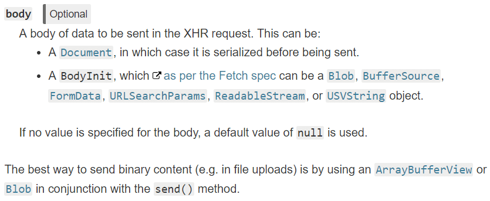
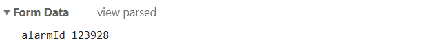

# 19-02-26 post请求的content-type

> 参考  
1.[四种常见的 POST 提交数据方式 - Jerry Qu](https://imququ.com/post/four-ways-to-post-data-in-http.html) :running:再看一遍？  
2.[Form content types](https://www.w3.org/TR/html401/interact/forms.html#h-17.13.4)  
3.[POST - MDN](https://developer.mozilla.org/en-US/docs/Web/HTTP/Methods/POST)  
4.[axios 中文说明](https://www.kancloud.cn/yunye/axios/234845)  
5.[XMLHttpRequest.send() - MDN](https://developer.mozilla.org/en-US/docs/Web/API/XMLHttpRequest/send)  
6.[Difference between application/x-www-form-urlencoded and multipart/form-data in HTTP/HTML?](https://javarevisited.blogspot.com/2017/06/difference-between-applicationx-www-form-urlencoded-vs-multipart-form-data.html)

[[toc]]

:::tip TODO 
nodejs或java中实测一下，不过现在还不会:laughing:  
:::

## 疑问
1. 为什么post(x-www-form-urlencoded)请求的参数最终也转换成键值对的形式。难道这是get请求，还是后台接口同时支持get和的post两种方法
2. 跨域options
3. axios是不是只要data是对象，就stringify

## content-type类型

HTTP协议规定POST请求提交的数据必须放在请求主体里，但没有规定格式

### 属性值

- get请求没有content-type项

- 原生form表单支持通过设置enctype来设置一下三种格式：
  - application/x-www-form-urlencoded(默认)
  - multipart/form-data(文件)
  - text/plain(不常用)

- ajax请求中除了使用上述几种外，还经常使用：
  - application/json

### 相关问题

**1.get和post application/x-www-form-urlencoded的区别？**

问题缘由：  
1. 后台使用java spring，所以一直很奇怪所有接口都可以使用get和post吗？那干脆就全使用get(当然除了上传或是复杂数据)
2. 这还让我一度怀疑get === post application/x-www-form-urlencoded？大雾:sob:  

结论：  
1. 从以下请求可以看出get参数确实是url后面键值对的形式，x-www-form-urlencoded同样是键值对形式，不过是将其放在请求实体中
2. 这种键值对也基本就相当于字符串(get的location.search)
3. 还需要注意的是这两种格式无法直接传输复杂数据层次的对象(当然单独将value stringify其实也可以，不过不如直接使用application/json)

```http
GET /hb2/rest/alarm/get.do?alarmId=123928&b=2 HTTP/1.1
```
```http
POST /hb2/rest/alarm/get.do HTTP/1.1
Content-Type: application/x-www-form-urlencoded
alarmId=123928&b=2
```
**2. post application/x-www-form-urlencoded 和 application/json？**  
json格式可以传输比键值对更复杂的结构化数据（项目刚开始还没文档时，axios默认传的就是json，后台并没有对应解析逻辑，这时会问题）


## axios和jQuery默认请求方式区别

axios默认将对象类型的data进行json.stringify。即使声明了`application/x-www-form-urlencoded`也不会将data变成键值对的形式，需要自行转换，比如使用[URLSearchParams](https://developer.mozilla.org/en-US/docs/Web/API/URLSearchParams)或者querystring模块

:::tip axios文档关于data的说明
`data` 是作为请求主体被发送的数据  
只适用于这些请求方法 'PUT', 'POST', 和 'PATCH'  
在没有设置 `transformRequest` 时，必须是以下类型之一：  
- string, plain object, ArrayBuffer, ArrayBufferView, URLSearchParams  
- 浏览器专属：FormData, File, Blob  
- Node 专属： Stream  
:::

### 原生AJAX
- send支持的格式


```js
// 原生XMLHttpRequest作对比
var xhr = new XMLHttpRequest()
xhr.onreadystatechange = function(){
  if(xhr.readyState === 4 && (xhr.status === 200 || xhr.status === 304)){
    console.log(xhr.responseText, 'xhr')
  }
}
xhr.open('post', '/alarm/get.do')
xhr.setRequestHeader('Content-Type', 'application/x-www-form-urlencoded')
// 参见XMLHttpRequest.send - MDN https://developer.mozilla.org/en-US/docs/Web/API/XMLHttpRequest/send
xhr.send('alarmId=123928')

```

### axios

默认content-type: 'application/json'，data也会自动转换为json字符串

```js
// 默认，只声明content-type为x-www-form-urlencoded是不起作用的，要同时将data处理成键值对字符串(如果不转换，相当于axios帮你stringify，然后一个string只能当form data的key，然后value为空，反正就是双拼两不像)
axios({
  method: 'post',
  url: '/alarm/get.do',
  headers: {'Content-Type': 'application/x-www-form-urlencoded'},
  data: {
    alarmId: 123928
  }
})

// 解决方式1 - 使用URLSearchParams API(不兼容IE)
var data = new URLSearchParams()
data.append('alarmId', 123928)
axios({
  // ~~~
  headers: {'Content-Type': 'application/x-www-form-urlencoded'},
  data
  // ~~~
})

// 解决方式2 - 使用node模块querystring
// data value支持<string> | <number> | <boolean> | <string[]> | <number[]> | <boolean[]>。 任何其他输入值都将被强制转换为空字符串
import qs from 'querystring'
axios({
  // ~~~
  headers: {'Content-Type': 'application/x-www-form-urlencoded'},
  data: qs.stringify({
    alarmId: 123928
  })
  // ~~~
})
```

### jQuery

默认content-type: 'application/x-www-form-urlencoded'，data会转换为是键值对string

jQuery application/x-www-form-urlencoded


```js
$.ajax({
  url: '/alarm/get.do',
  method: 'POST',
  // contentType: 'application/x-www-form-urlencoded',
  data: {
    alarmId: 123928,
  }
})
```

jQuery applcation/json需要data必须是json字符串，content-type也要设置正确
```js
$.ajax({
  url: '/alarm/get.do',
  method: 'POST',
  contentType: 'application/json',
  data: JSON.stringify({
    alarmId: 123928
  })
})
```

## TODO 
1. 跨域请求哪些会先发送options请求
2. 跨域
