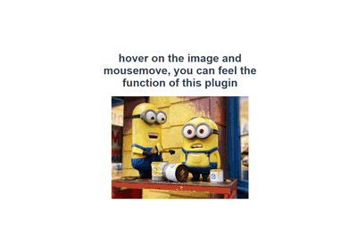

# 19-02-27 vue插件编写小结

> 参考  
1.[Creating Custom Vue.js Plugins - Joshua Bemenderfer](https://alligator.io/vuejs/creating-custom-plugins/)  
2.[正确使用Vue指令的钩子函数 - 王昱森](https://www.imys.net/20161216/vue-custom-directive-hook.html)  

:::tip TODO
1. 还需参考优秀插件编写方式进行优化  
2. bug修复（忘了上次遇到什么问题了，尴尬，动画对其他操作的影响也要考虑下，正好下一篇写FLIP动画）  
3. 测试假设一个页面有多个容器
4. 思考一下，其实有两个选项，是做组件型的插件还是指令型的插件呢？ 
5. Vue.use(xx, {})的第二个对象是传给install方法的第二个参数，适合传入一些插件公用配置
6. 对于这种多图片使用的插件呢，绑定容器好呢，还是绑定单张好呢？性能？能不能获取到子图片
7. img的key非常重要，不加的话，随机更新一个位置了
8. vue-element-admin封装方式
9. 图片更新时，key是必要项吗，还是比较迷的，有key时，先bind，inserted等等，bind后面夹着一个unbind上一张图片的，没有key时则没有unbind好像问题不大？不过昨天测试时，图片更新后的动画好像有可能不再更新的图片上，与v-show有关系吗？我猜与img上的key或者父组件上的key有点关系？
:::

:::warning 忠告
如果想写关于刚实践过的东西的blog，最好当时就写。过了很久才动笔的话，就要重头看一遍，测试一下，很是费时间
:::

:::tip
本文基于vue-img-hover-zoom-in v-0.2.2，插件在实际项目中使用完全ok。不过，实现上还有修改的空间，后续文章会随插件版本继续更新
:::

[[toc]]

在使用Vue一些优秀的插件时，就想自己动手实践一下。一直偷懒，不过，后来还是将项目中的一些通用部分做成了插件，减少了点耦合，增加了代码通用性。Vue向插件提供了`Vue`这个构造器，所以你几乎可以写出你想要的任何插件。从[插件文档](https://cn.vuejs.org/v2/guide/plugins.html)中便可感受一二，包括：
> - 添加全局方法或者属性
> - 添加全局资源：指令/过滤器/过渡等
> - 通过全局 mixin 方法添加一些组件选项
> - 添加 Vue 实例方法，通过把它们添加到 Vue.prototype 上实现
> - 一个库，提供自己的 API，同时提供上面提到的一个或多个功能

## 需求

[vue-img-hover-zoom-in](https://github.com/guidetheorient/vue-img-hover-zoom-in)是动手实践的第一个插件。功能如下：  
1.鼠标悬浮在特定图片上时，显示一个根据鼠标位置变化尺寸的放大图  
2.右键自定义菜单弹出时隐藏，菜单消失后，再显示  



之前将其写成通用组件时，代码分散，不利于维护。分成了四部分：  
- 放大图组件
- 耦合在父组件中的监听鼠标移入移出方法
- mixin提供鼠标移入移出方法的回调函数，还需处理能否显示的逻辑
- vuex中用来传递show, canShow, mouseEvent对象

插件在实测中遇到了一些问题（现在没有这些问题了）：
- 切换到别的路由，上一页面的放大图还在显示
- 切换到别的路由再切换回来，放大图不能显示
- 图片定时会更新一次，当图片更新时，放大图不能显示
- 右键呼出自定义菜单后，再关闭，放大图不能显示
- 切换路由后，在空白背景区域出现了上一页面的放大图

## 实现

实现主要分为两部分：组件用于放大图显示、install方法中用于监听鼠标事件，处理显示隐藏的逻辑。下面为install方法地注释，组件的实现比较简单，这里不作细述。

```js
// index.js 
import hoverImgComponent from './index.vue'

const hoverZoomImg = {
  install (Vue, options = {}) {
    // ~~~省略初始化代码~~~
    let contextmenuShow = false
    document.addEventListener('click', e => {
      // click肯定操作肯定会使菜单消失，所以如果click后，放大图能显示，至于鼠标位置有没有可以显示的图片，这部分逻辑都在hoverImgComponent组件中
      // 如果contextmenuShow为false，那么不需要任何操作，要么切换了路由，要么没有触发任何交互
      if (contextmenuShow) {
        setTimeout(() => {
          contextmenuShow = false
          instance.setCanShow(true)
        }, 100)
      }
    })
    // 菜单显示时，不显示放大图
    document.addEventListener('contextmenu', (e) => {
      contextmenuShow = true
      instance.setCanShow(false)
    })
    document.addEventListener('mousemove', (e) => {
      instance.setEvent(e)
    })
    // 随缘mixin，如果使用了vue-router的话，便可进行一顿操作，没有的话也就当是无用代码了
    Vue.mixin({
      beforeRouteLeave (to, from, next) {
        instance.imgSrc = null // 防止跳转页面显示上个页面跳转时出现的大图
        instance.containerId = null // 路由切换后需要触发容器重新计算的watch
        contextmenuShow ? next(false) : next() // contextmenu出现时，一次click只能使contextmenu隐藏，而不是离开页面
      }
    })
    function onMouseEnter (e) {
      instance.setEvent(e)
      instance.setShow(true)
    }
    function onMouseLeave () {
      instance.setShow(false, true)
    }

    Vue.directive('hover-zoom-img', {
      bind (el, binding = {}) {
        let { containerId } = binding.value || {}
        instance.containerId = containerId
      },
      // 使用了两个标志位，canShow控制是否有权限显示（contextmenu出现时），show表示此处有可以显示的资源（img）
      inserted (el) {
        el.addEventListener('mouseenter', onMouseEnter)
        el.addEventListener('mouseleave', onMouseLeave)
      },
      unbind (el) {
        el.removeEventListener('mouseenter', onMouseEnter)
        el.removeEventListener('mouseleave', onMouseLeave)
        instance.show && instance.setShow(false)
      }
    })
  }
}

export default hoverZoomImg
```

## 指令的钩子函数

使用指令时有五个钩子函数bind, inserted, update, componentUpdated, unbind，参照[自定义指令 - 钩子函数](https://cn.vuejs.org/v2/guide/custom-directive.html#%E9%92%A9%E5%AD%90%E5%87%BD%E6%95%B0)和[正确使用Vue指令的钩子函数 - 王昱森](https://www.imys.net/20161216/vue-custom-directive-hook.html)便可了解这些钩子的触发条件。

示例代码操作如下：
1. 加载后，点击`update test`，打印`update hello`、`componentUpdated hello`
2. 点击`update`，打印`update hello`、`componentUpdated hi`(componentUpdated在组件及其子组件更新完毕后调用)
3. 点击`unbind`，打印`unbind`
4. 点击`bind`，打印`bind null`、`inserted <div class="wrapper">...</div>`

```vue
<template>
  <div class="wrapper">
    <div>{{test}}</div>
    <button @click="test++">update test</button>
    <div v-if="msg" v-test>{{msg}}</div>
    <button @click="update">update</button>
    <button @click="bind">bind</button>
    <button @click="unbind">unbind</button>
  </div>
</template>

<script>
export default{
  data() {
    return {
      msg: 'hello',
      test: 1
    }
  },
  methods: {
    update() {
      this.msg = 'hi'
    },
    unbind() {
      this.msg = ''
    },
    bind() {
      this.msg = 'hello'
    }
  }
}
</script>
```
```js
Vue.directive('test', {
  bind (el) {
    console.log('bind', el.parentNode)
  },
  inserted (el) {
    console.log('inserted', el.parentNode)
  },
  update(el) {
    console.log('update', el.innerHTML)
  },
  componentUpdated(el) {
    console.log('componentUpdated', el.innerHTML)
  },
  unbind (el) {
    console.log('unbind')
  }
})
```

### 区别

#### bind和inserted
- `bind`时parentNode为null，`inserted`时有值，和官网描述一致。`bind`在绑定时调用，`inserted`在插入父节点时调用。  

#### update和componentUpdated
- `update`和`componentUpdated`在整个组件有更新时即触发，所以触发次数会很多，可以通过对比vnode和oldVnode来忽略不关注的更新。  
- `update`时msg还是原值，`componentUpdated`时更新后的值，没毛病。  

:::tip TODO
https://madewithvuejs.com/plugins  
:::
