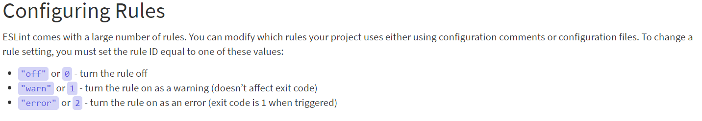
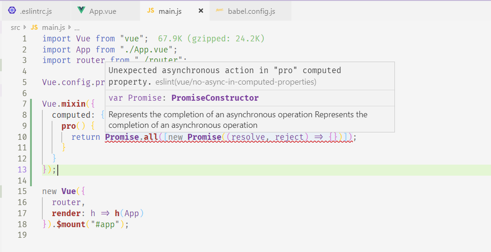
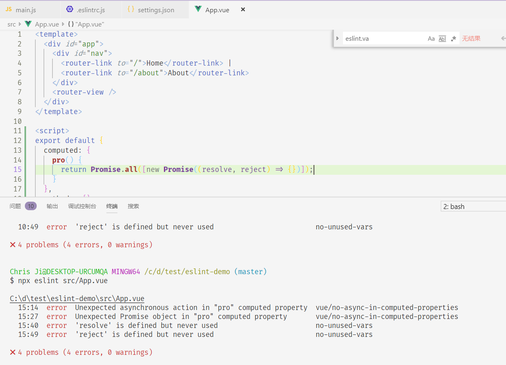
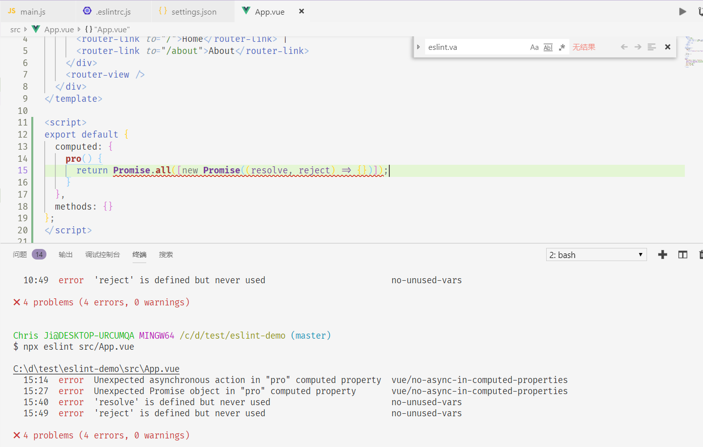
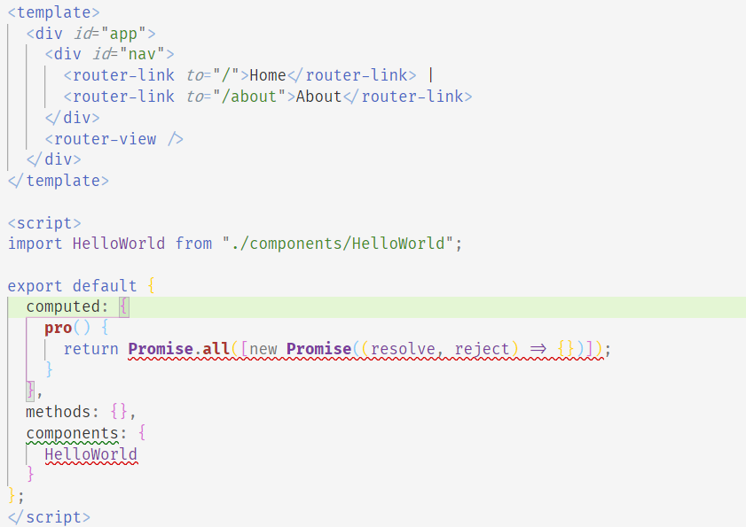
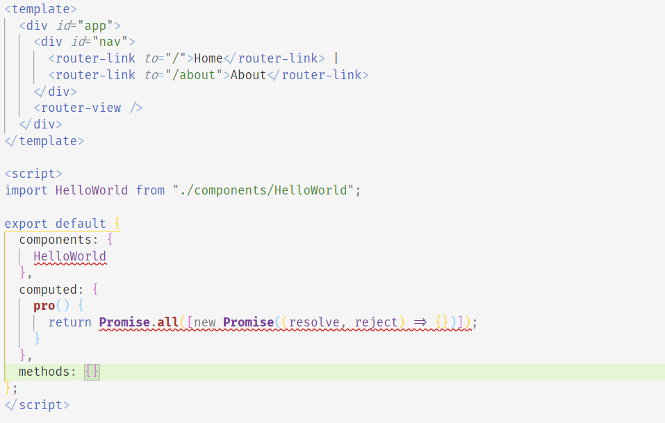
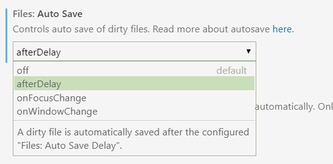
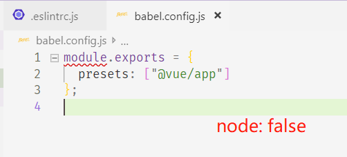

# 19-03-06 eslint配置指南

:::tip 本文目标
分清众多ESLint相关工具的功能
:::

TOC

[[toc]]

## 工具功能说明

npm包ESLint，这是所有其他工具起作用的基础，它所提供的Node.js API不仅供自己使用(如：命令行)，也可以被其他程序调用

编辑器插件ESLint，如[VSCode ESLint](https://marketplace.visualstudio.com/items?itemName=dbaeumer.vscode-eslint)，主要是使用 [ESLint CLI Engine API](https://eslint.org/docs/developer-guide/nodejs-api#cliengine)来扩展编辑器的功能，如波浪线提示lint error、autofix等。 

webpack eslint-loader同样是调用ESLint的Node.js API，可以通过配置得到和编辑器插件相似的功能。如传入`fix: true`的option，那么在`npm run dev`时，也会像拥有编辑器插件的autofix功能，并且跟随热更新自动lint和fix代码。当然也可以在控制台输出校验失败代码的详细信息，相当于命令行运行`npx eslint --ext .js,.vue src`。

## ESLint plugin & config

- eslint-config-*是eslint默认规则集的命名规范，如eslint-config-airbnb。
- eslint-plugin-*是eslint插件的默认命名贵伐，如eslint-plugin-vue。
- extends有四种种类型`plugin:vue/essential`、`standard`、`eslint:recommend`、`@vue/prettier`？  
[ESLint官方文档 - Extending Configuration Files](https://eslint.org/docs/user-guide/configuring#extending-configuration-files)  
[ESLint官方文档 - Plugins in scoped packages are now resolvable in configs](https://eslint.org/docs/user-guide/migrating-to-5.0.0#-plugins-in-scoped-packages-are-now-resolvable-in-configs)
```js
extends: [
  'plugin:vue/essential',
  'standard',
  'eslint-config-alloy',
]
```
- plugins为什么直接写`vue`就行？  
[ESLint官方文档 - Configuring Plugins](https://eslint.org/docs/user-guide/configuring#configuring-plugins)
```js
plugins: [
  'vue'
]
```
- eslint rule开启关闭


### eslint-plugin-vue

- 作用：
  检查以下场景下的代码：  
  [eslint-plugin-vue - How ESLint detects components?](https://vuejs.github.io/eslint-plugin-vue/user-guide/#how-eslint-detects-components)
    - `Vue.component()` expression
    - `Vue.extend()` expression
    - `Vue.mixin()` expression
    - `export default {}` in `.vue` or `.jsx` file
    - 用户自定义对象前加上`// @vue/component`

- 安装：yarn add -D eslint-plugin-vue === vue add @vue/cli-plugin-eslint(vue-cli3)(确保安装了eslint)
- [vue-cli3内置的规则](https://github.com/vuejs/vue-cli/tree/dev/packages/%40vue)
- [eslint-plugin-vue内置的vue规则详细说明](https://vuejs.github.io/eslint-plugin-vue/rules/)
- [编辑器集成](https://vuejs.github.io/eslint-plugin-vue/user-guide/#editor-integrations)


## prettier

[What's the difference between prettier-eslint, eslint-plugin-prettier and eslint-config-prettier?](https://stackoverflow.com/questions/44690308/whats-the-difference-between-prettier-eslint-eslint-plugin-prettier-and-eslint)  
### prettier
[prettier](https://prettier.io/docs/en/options.html)  
单独的格式化工具，如果独立于eslint使用，两者规则必然会有一些冲突。

### eslint-plugin-prettier
利用eslint的格式化API来进行prettier

### eslint-config-prettier
prettier格式化的规则集和用户自定义的js、vue、react等规则集有冲突，所以不论是独立于eslint的prettier或是eslint的插件eslint-plugin-prettier，都需要将eslint-config-prettier写在`extends`最后，用于关闭所有prettier定义过的格式化规则。

[@vue/eslint-config-prettier](https://github.com/vuejs/vue-cli/blob/dev/packages/%40vue/eslint-config-prettier/index.js)
```js
// @vue/eslint-plugin-prettier的index.js
module.exports = {
  plugins: ['prettier'],
  extends: [
    'eslint:recommended',
    require.resolve('eslint-config-prettier'),
    require.resolve('eslint-config-prettier/vue')
  ],
  rules: {
    'prettier/prettier': 'warn'
  }
}
```


## 编辑器集成

### VSCode

#### eslint.validate
eslint.validate是让vscode的eslint插件可以识别.vue文件并在文件中给出错误提示。不管是否配置`npx eslint filename`都可以显示错误信息  
```json
{
  "eslint.validate": [
    "javascript",
    "javascriptreact",
    "html",
    "vue",
  ]
}
```
- 没有配置

  

- 有配置  

  

#### eslint.autoFixOnSave
eslint.autoFixOnSave为true，并且validate中加上autoFix才能自动格式化  

```json
{
  "eslint.autoFixOnSave": true,
  "eslint.validate": [
    "javascript",
    "javascriptreact",
    "html",
    { "language": "vue", "autoFix": true }
  ]
}
```
- 初始

  

- true并且配置validate中的vue的autoFix



#### files.autoSave

autoSave设置为afterDelay不会生效，但是手动ctrl+S还是可以lint的，相当于手动fix和autoSave


#### 最终配置

```json
{
  // "files.autoSave": "off", 可不配置
  "eslint.run": "onSave",
  "eslint.autoFixOnSave": true,
  "eslint.validate": [
    "javascript",
    "javascriptreact",
    "html",
    { "language": "vue", "autoFix": true },
    // 用到react，ts需配置
    // { "language": "typescript", "autoFix": true },
    // { "language": "typescriptreact", "autoFix": true}
  ],
  // 如果安装了vetur插件，需要关闭这个选项
  "vetur.validation.template": false
}
```


## 参考

> [eslint-config-alloy](https://www.npmjs.com/package/eslint-config-alloy)  
[eslint-config-alloy 规则集详细说明](https://alloyteam.github.io/eslint-config-alloy/)  
[VSCode - ESLint](https://marketplace.visualstudio.com/items?itemName=dbaeumer.vscode-eslint)  


## 其他

eslint-friendly-formatter
页面报错
vuepress自动获取md生成sidebar
eslint-plugin-vue/docs/.vuepress/config.js

node: false


[vetur](https://vuejs.github.io/vetur/linting-error.html#error-checking)


问题：规则中不加分号，如果遇到不加有歧义的情况呢？
map forEach循环时什么时候要return，什么时候直接更改了？
switch 的 case中的break, return 或 throw
try catch finally
semi必须加的场景

npx eslint --ext .js,.vue src/
npx eslint --format node_modules/eslint-friendly-formatter --ext .js,.vue src/
http://inimino.org/~inimino/blog/javascript_semicolons
https://hackernoon.com/an-open-letter-to-javascript-leaders-regarding-no-semicolons-82cec422d67d
