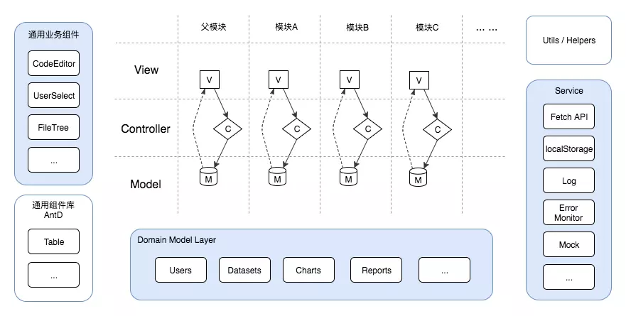

# vue项目组件目录组织

## 场景

- camera-detail中preset-table和preset-edit-dialog互为父子级，但都只是camera-detail中的子组件，如何梳理结构
- 父组件传递给子组件一个对象，如何优雅地使用props，可修改对象（不使用深拷贝的情况下）（两种情况，一种父组件不适用props，第一种父组件会使用props）
- 组件使用到vuex数据，比如table使用了presetList，此时需要新增，那是需要深拷贝一份？？感觉不太正常的写法，修改也是深拷贝一项，再update？？


vue组件编码规范
vue组件层级组织


## 其他

new Regexp()与//的使用场景以及转义
string.match
new Function()


规则：
如果对象只通过父组件分发给子组件，父组件不作他用，那么可以双向绑定v-model
如果父组件需使用？？？？


```md
|-- components
|   |-- owners-editor.vue
|   |-- area-select
|   |   |-- area-select.vue
|   |-- base
|   |   |-- card-table
|   |       |-- card-table.vue
|   |-- btn-group
|   |   |-- btn-group.vue
|   |-- cam-info-form
|   |   |-- cam-info-form.vue
|   |-- cam-tree-dialog
|   |   |-- cam-tree-dialog.vue
|   |-- date-range-pick
|   |   |-- date-range-pick.vue
|   |-- error-page
|   |   |-- error-page.vue
|   |-- map
|   |   |-- map-marker-blue.png
|   |   |-- map-marker-red.png
|   |   |-- map.vue
|   |-- menu
|   |   |-- helper.js
|   |   |-- menu-container.vue
|   |   |-- menu-recursion.vue
|   |   |-- components
|   |       |-- menu-item.vue
|   |       |-- menu.vue
|   |       |-- icon
|   |           |-- icon.vue
|   |-- multilevel-menu
|   |   |-- multilevel-menu.vue
|   |-- send-sms-dialog
|   |   |-- send-sms-dialog.vue
|   |-- set-alarm-dialog
|   |   |-- set-alarm-dialog.vue
|   |-- set-alarm-false-dialog
|   |   |-- set-alarm-false-dialog.vue
|   |-- set-alarm-true-dialog
|   |   |-- set-alarm-true-dialog.vue
|   |-- set-rain-mode-dialog
|   |   |-- set-rain-mode-dialog.vue
|   |-- time-count
|   |   |-- index.vue
|   |-- video-player
|   |   |-- video-player.vue
|   |-- video-player-2
|       |-- video-player.vue
|-- router
|   |-- index.js
|-- views
    |-- admin-cams
    |   |-- index.vue
    |   |-- components
    |   |   |-- area-select
    |   |   |   |-- area-select.vue
    |   |   |-- edit-cam-info-dialog
    |   |       |-- edit-cam-info-dialog.vue
    |-- admin-check-group
    |   |-- index.vue
    |-- admin-enforce-cf
    |   |-- index.vue
    |-- admin-index
    |   |-- index.vue
    |-- admin-opc
    |   |-- index.vue
    |-- admin-roles
    |   |-- index.vue
    |   |-- components
    |   |   |-- role-create-dialog
    |   |   |   |-- role-create-dialog.vue
    |   |   |-- role-edit-dialog
    |   |   |   |-- role-edit-dialog.vue
    |   |   |-- role-form(deprecated)
    |   |       |-- role-form.vue
    |-- admin-screen
    |   |-- index.vue
    |   |-- decoder-detail.vue
    |   |-- screen-detail.vue
    |-- admin-sys-cf
    |   |-- index.vue
    |-- admin-users
    |   |-- index.vue
    |   |-- components
    |   |   |-- user-create-dialog
    |   |       |-- user-create-dialog.vue
    |-- alarm-detail
    |   |-- index.vue
    |-- big-screen
    |   |-- index.vue
    |   |-- components
    |   |   |-- alarm-count
    |   |   |   |-- alarm-count.vue
    |   |   |-- alarm-history
    |   |   |   |-- alarm-history.vue
    |   |   |-- alarm-process
    |   |   |   |-- alarm-process.vue
    |   |   |   |-- pie.vue
    |   |   |-- base
    |   |   |   |-- card
    |   |   |       |-- card.vue
    |   |   |-- cam-status
    |   |   |   |-- cam-status.vue
    |   |   |-- current-alarm
    |   |   |   |-- current-alarm.vue
    |   |   |-- group-inspect
    |   |   |   |-- group-inspect.vue
    |   |   |-- header
    |   |   |   |-- header.vue
    |   |   |-- inspect-linkage
    |   |   |   |-- inspect-linkage.vue
    |   |   |-- response-time
    |   |       |-- response-time.vue
    |-- camera-detail
    |   |-- index.vue
    |   |-- components
    |   |   |-- area-draw-btn
    |   |   |   |-- index.vue
    |   |   |-- area-draw-canvas
    |   |   |   |-- index.vue
    |   |   |-- cam-info-popover
    |   |   |   |-- cam-info-popover.vue
    |   |   |-- camera-info-card
    |   |   |   |-- camera-info-card.vue
    |   |   |-- enforcer-add-dialog
    |   |   |   |-- enforcer-add-dialog.vue
    |   |   |-- enforcer-card
    |   |   |   |-- enforcer-card.vue
    |   |   |-- manual-draw
    |   |   |   |-- index.vue
    |   |   |-- manual-draw-dialog
    |   |   |   |-- manual-draw-dialog.vue
    |   |   |-- map
    |   |   |   |-- index.vue
    |   |   |-- preset-edit-dialog
    |   |   |   |-- preset-edit-dialog.vue
    |   |   |-- preset-table
    |   |       |-- preset-table.vue
    |-- cameras
    |   |-- index.vue
    |   |-- components
    |   |   |-- context-menu
    |   |   |   |-- index.vue
    |   |   |-- video-player-ct
    |   |       |-- video-player-ct.vue
    |   |-- mixins
    |       |-- splitCameraViews.js
    |-- check-item
    |   |-- checklog.vue
    |   |-- index.vue
    |   |-- components
    |   |   |-- group-camlist-card
    |   |   |   |-- group-camlist-card.vue
    |   |   |-- group-edit-card
    |   |       |-- group-edit-card.vue
    |-- dashboard
    |   |-- index.vue
    |   |-- components
    |       |-- card
    |       |   |-- index.vue
    |       |-- chart
    |           |-- bar.vue
    |           |-- line-count.vue
    |           |-- pie-count.vue
    |-- error-pages
    |   |-- 401.vue
    |   |-- 404.vue
    |-- event-detail
    |   |-- index.vue
    |-- event-history
    |   |-- index.vue
    |-- layout
    |   |-- index.vue
    |   |-- components
    |   |   |-- alarm-notification
    |   |   |   |-- alarm-notification.vue
    |   |   |-- avatar
    |   |   |   |-- avatar.vue
    |   |   |-- nav
    |   |   |   |-- index.vue
    |   |   |-- sidebar
    |   |       |-- index.vue
    |-- log-history
    |   |-- image-history.vue
    |   |-- index.vue
    |   |-- components
    |   |   |-- alarm-cell
    |   |   |   |-- alarm-cell.vue
    |   |   |-- delete-group-alarm-dialog
    |   |   |   |-- delete-group-alarm-dialog.vue
    |   |   |-- group-btn-group
    |   |   |   |-- group-btn-group.vue
    |   |   |-- group-head-cell
    |   |   |   |-- group-head-cell.vue
    |   |   |-- set-group-alarm-ignore-dialog
    |   |   |   |-- set-group-alarm-ignore-dialog.vue
    |   |   |-- set-group-alarm-true-dialog
    |   |       |-- set-group-alarm-true-dialog.vue
    |-- login
    |   |-- index.vue
    |-- map
    |   |-- index.vue
    |-- opc-detail
    |   |-- index.vue
    |-- reset-pwd
    |   |-- index.vue
    |-- user-detail
        |-- index.vue
        |-- components
        |   |-- user-cams-card
        |   |   |-- user-cams-card.vue
        |   |-- user-edit-card
        |   |   |-- user-edit-card.vue
        |   |-- user-enforce-card
        |       |-- user-enforce-card.vue
```


