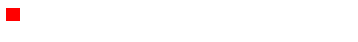

# 19-04-07 requestAnimationFrame

> 参考  
> [1. requestAnimationFrame - JavaScript标准参考教程](http://javascript.ruanyifeng.com/htmlapi/requestanimationframe.html)  
> [2. 你知道的requestAnimationFrame【从0到0.1】 - 慎玄](https://juejin.im/post/5c3ca3d76fb9a049a979f429)  
> [3. A Comparison of Animation Technologies - CSS Tricks](https://css-tricks.com/comparison-animation-technologies/)  
> [4. CSS3动画那么强，requestAnimationFrame还有毛线用？](https://www.zhangxinxu.com/wordpress/2013/09/css3-animation-requestanimationframe-tween-%E5%8A%A8%E7%94%BB%E7%AE%97%E6%B3%95/)  
> 其他  
> [1. 理解WebKit和Chromium: 渲染主循环(main loop)和requestAnimationFrame](https://blog.csdn.net/milado_nju/article/details/8101188)  
> [2. 无线页面优化实例](http://caibaojian.com/requestanimationframe.html#t3)  
> [3. setTimeout, setInterval 和 requestAnimationFrame](https://github.com/stephentian/33-js-concepts#18-settimeout-setinterval-%E5%92%8C-requestanimationframe)  

`requestAnimationFrame`是一个类似于`setTimeout`的定时执行接口，是主要用来执行动画的web API，它接收一个回调函数用于在浏览器下次重绘之前执行，它使得开发者掌握了动画何时执行的主动权。相比`setTimeout`，`requestAnimationFrame`和浏览器的刷新频率保持一致，并且在标签隐藏等情况下，停止执行，因此可以降低资源消耗。更详细介绍见参考1，2

> 不过有一点需要注意，requestAnimationFrame是在主线程上完成。这意味着，如果主线程非常繁忙，requestAnimationFrame的动画效果会大打折扣。

`requestAnimationFrame`也有类似`clearTimeout`的清除方法`cancelAnimationFrame`，使用方式相同

## 实例

### 1. 


```html
<style>
  #rect{
    width: 10px;
    height: 10px;
    background: red;
  }
</style>

<div id="rect"></div>

<script>
  let el = document.getElementById('rect')
      
  function animate() {
    if(el.clientWidth < 200) {
      el.style.width = el.clientWidth + 1 + 'px'
    }
    requestAnimationFrame(animate)
  }
  requestAnimationFrame(animate)
</script>
```
### 2.悬浮切换背景动画

:::danger
注意在mouseenter, mouseleave切换时需要先清除当前id, 否则enter, leave的动画一直执行不会停止，实际表现为图片卡在某个位置
:::


```html
<style>
  .icon {
    position: relative;
    margin: 0 auto;
    height: 90px;
    width: 92px;
    background-size: 92px;
    background-position: 0 0;
    background-image: url('./icon01.png')
    cursor: pointer;
  }
</style>

<div class="icon"></div>

<script>
let el = document.querySelector('.icon')
let h = 90
let count = 0
let id

el.addEventListener('mouseenter', function() {
  cancelAnimationFrame(id)
  id = requestAnimationFrame(hoverIn)
})
el.addEventListener('mouseleave', function () {
  cancelAnimationFrame(id)
  id = requestAnimationFrame(hoverOut)
})
// 要先清除
// el.addEventListener('mouseenter', hoverIn)
// el.addEventListener('mouseleave', hoverOut)

function setPos() {
  el.style.backgroundPositionY = `-${count * 90}px`
}

function hoverIn() {
  count++
  if(count < 31) {
    setPos()
    id = requestAnimationFrame(hoverIn)
  } else {
    cancelAnimationFrame(id)
  }
}

function hoverOut() {
  count--
  if(count >= 0) {
    setPos()
    id = requestAnimationFrame(hoverOut)
  } else {
    cancelAnimationFrame(id)
  }
}
</script>
```

## todo
1. 与其他方式animation的性能对比
2. time-function
