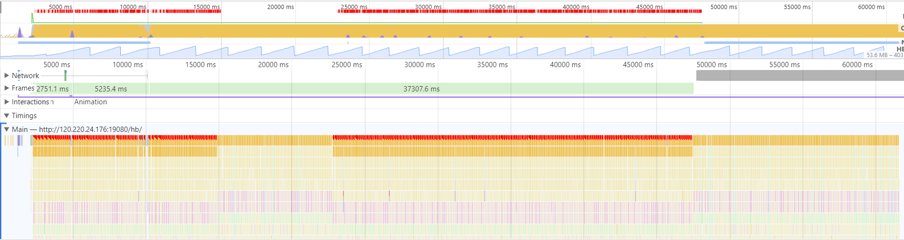

# 19-04-15 记一次Vue性能优化

项目中有一个页面类似于摄像头监控平台，不过显示的是**不断更新**的图片，不是视频流。并且，所有摄像头默认展示在**一屏**中。开始时，一般都是100多个摄像头，表现尚可。但随着摄像头数量增多，页面**卡死**，进入其他页面异常**缓慢**等问题就出现了。

TOC
[[toc]]

## 问题
1. 首页大量图片加载导致页面卡顿或卡死(cpu usage: 100%)
2. 进入首屏后，首次进入其他页面非常慢

## 前置

下文的优化和测试都基于以下几条说明：
- 摄像头列表camList长度为332
- 摄像头列表camList是一个对象型数组`Array<Camera>`。下文中，假定对象为`Camera`类的实例，用`cam`或者`camera`来表示单个实例
- 项目之前是使用java + jsp写的单页应用，之后用Vue重写了，但首页的功能基本类似，即展示摄像头抓拍图片，下图即为局部截图


### 测试 - 优化前

- 以下为优化前的新旧系统数据对比，旧系统（java + jsp）为线上系统，新系统(vue spa)为本地开发系统

|类目|旧|新|
| - | - | - |
|CPU Usage|10%上下|80%-100%|
|JS Heap Size|20M上下|166M~381M(GC后内存可能有缓慢增加)|

- 以下为新系统长时间测试数据

|比较对象|开始|结束|下午结束|
| - | - | - | - |
|Memory Footprint|179M|500M|700M|
|JavaScript Merory|100多M|340M|300多M|
|CPU| - |有时会到100%| - |

- 也测试很多内存相关的Heap snapshot，不过好像不是卡顿的重点，倒是内存泄漏的重点，但是被Vue处理过的对象很难搜索到，有待探索。

### 测试 - performance（优化前后）

- 重构前

- js（不当编码导致的）占用cpu过高的问题

- 简化浏览器绘制复杂度，降低绘制区域


## JS/Vue性能

### 原因梳理

由上面的测试结果可知，卡死和cpu占用太高有关，开始时YY的一些错误的原因
1. websocket持续接收数据并更新图片，图片请求太多  
-> 请求过多并不会导致卡死，但会导致阻塞其他文件的下载。开始是限制了图片请求数量在设定范围的，但是没有改善效果
2. 深拷贝camList  
-> 重点搞错了，深拷贝勉强可接受，并且频率很低
3. 图片更新会使用css动画  
-> GPU关联更大，开始结束的监听占用cpu较少

在一直YY着要不要换用模板引擎，但这次优化完才知道并不是什么库的性能问题，而是自己还不知晓一些核心原理，从而组织出了低质量的代码。综合以上，原因主要是未拆分父子组件导致这个大组件一直不停的_update，哪怕只有某个camera对象的一个属性发生变化。

### 解决方案

- 拆分父子组件
- 使用数组遍历数据，再用对象辅助查找更新数据
- 首次加载时不使用过渡动画
- 控制图片同时加载数

以下3个参考链接是Vue.js团队核心成员Akryum分享的一些vue性能优化技巧，包括ppt、代码、预览，其中拆分父子组件则是我此次第一个优化项，因为首屏的这个组件说来有一点复杂，但实际结构还是比较简单的，就是一个v-for，所以之前写在一个组件中，去除css代码也就330行. 第一项改动引起的处理逻辑的改变导致了更大的优化

> 参考  
[1. 9 performance secrets revealed - Akryum](https://slides.com/akryum/vueconfus-2019)  
[2. vue-9-perf-secrets - github - Akryum](https://github.com/Akryum/vue-9-perf-secrets)  
[3. vue-9-perf-secrets - preview - Akryum](https://vue-9-perf-secrets.netlify.com/)  

### 实施及说明

- 拆分父子组件后，数组中对象的增量更新不会影响到父组件，只单独更新子组件，因为camList为`Array<Object>`，所以使用`Object.assign(oldCam, cam);`更新，影响范围就被限制在了一个子组件中。

- 拆分组件前，需要添加修改一些属性来控制视图，比如`loaded`控制图片加载，`prePicture`存储前一张图片等。数据又在vuex中管理。这么一来，只要一张图片请求就会连续不断的更新`CamList`，从而导致组件更新，这是卡顿最大的原因所在。拆分组件后，自然而然地这些变量都会在子组件中维护，去除了大量非必要的update，这就是上文所说的**更大的优化**。

<!-- TODO: 是不是测试一下Vue.set和不使用的情况 -->
- 拆分组件前，更新`loaded`这些属性时，都是遍历数组，再使用`Vue.set`，`Vue.set`会触发视图的强制更新，当然这里使不使用其实视图都会更新，但显然修改数组中对象的属性是不需要使用它的。

- `getCellWH`是计算列表每小格宽高等，优化前只要camList发生改变即执行，这显然很不合逻辑，其实只有当camList.length（当然浏览器宽高变化也需要）发生变化时才需要重新计算，而不是哪个camera的属性发生了变化都需要执行。

- 在更新camList中的某一项时，可以考虑另存一份对象作为查找的Map，这样直接去掉了数组遍历所需时间。可能数组长度300多也没什么，但是对象通过key查找value几乎瞬间，更不用说后面可能有几万条数据。我从来都知道引用类型的概念，但我却没想到可以这样优化代码。

- 优化前，有一个问题一直令我很困惑，那就是首页点击进入其他页面很慢，要20多秒，我一直朝着hash路由在页面内容过于复杂时，响应就会很慢的方向上撞了南墙也不回头。又看到老的jsp项目丝般顺滑的切换，我都自闭了。直到上述优化项都改的差不多了，才恍然大悟，请求多不会卡死页面，但会把其他请求卡在后面啊，页面使用了路由懒加载，切换页面时，路由hook是立刻就反应了，但是页面所需的js，css怎么抢得过正在疯狂更新的图片请求。所以需要用一个队列来控制图片加载数。

- 开始修改的时候，还用了`Object.freeze`来遍历每个对象，减少了Vue设置getter、setter的工作。不过，freeze还是主要用于不怎么变化的数据比较好，本案例中，不断更新的camera对象，还需要使用`Vue.set`来替换掉旧的camera对象，这是非常不可取的。

- 使用freeze其实就和对象放在全局或是在created hook中手动添加的数据类似，即没有响应式


### 实验

:::tip
以下仅为一些测试的结果及猜测，具体需要等看完源码之后再实测总结
:::

前提：现有一对象型数组，形如`arr = [{....}, {....}, {....}]`

1. 将数组中对象遍历使用Object.freeze，数组加入响应式，当数据变化时，使用`Vue.set(arr, i, Object.freeze(newObj))`更新，替换后的对象仍为非响应式，如果`Vue.set(arr, i, newObj)`，那么该对象也全部加入了响应式。
2. 修改某个对象的属性，使用实例的watch方法，不加`deep: true`是watch不到数组的变化的，但这和Vue本身的watcher概念是两回事，因为添加响应式时，对象是递归所有属性添加响应式的，所以Vue本身是可以侦测到变化的，比如在template中使用到了这个属性，此时会重新渲染（即vnode和页面会更新）。所以实际使用时，修改数组中的对象属性时，并不需要随时使用`Vue.set`，它只是针对边界情况，比如添加plain object的属性等情况。另外它也会强制触发视图更新。
3. 依据第二点，当将arr通过v-for传值给子组件时，我们修改某个对象的属性后，变化会更新到对应的子组件，当然父组件其实也能侦测到arr的变化，不过具体更不更新vnode，其实还要看到底有没有用到这个属性等diff的情况。
4. 依据第二点，假设在store.getters中`item1 => state.test.arr[0]` 再在组件中watch这个item1，可以看到即使item1没有变化(watch的oldVal === val)，只要arr有变化仍然会被computed并被watch到。所以有些值可以等到用时再进行计算，不然arr中的一点点变化都会触发computed。
5. vue源码中的`_update`，如果是修改一个item的属性，如果这个属性在当前页面中并没有渲染，那么不会触发`_update`中的`__patch__`方法，如果子组件中渲染了，则只会update这一个子组件，但是如果`Vue.set(arr, i, item)`，那么父组件肯定会触发一次更新，即使这个属性子组件没有渲染，（猜测这个update只管VNode，但之前的响应式数据的前后对比操作用时有疑问），如果直接替换freeze的对象，比如`arr[i] = Object.freeze({...item, name: 'lala'})`，vue又不会捕捉到数据变化
6. 最终测试边界情况，arr中包含12万条后端定义的Camera实例时，会报`Maximum call stack size exceeded`，但我认为实际分片请求会更好，每次请求将之前的丢掉，才是比较合理的方案。

## 渲染性能

- 摄像头每行使用div包裹，减少repaint  

在JS/Vue性能这部分修改完后，我使用performace测试了以下，结果的截图在前文[测试-performance（优化前后）](#测试-performance（优化前后）)中，感觉效果不错的同时，发现了一个奇怪的问题，就是在更新图片时，这个紫色（layout & update layer tree）和绿色(paint & composite layers)区域的cpu占用很高，不就是很小的一块区域吗？打开devtools的render选项卡，勾选paint flashing发现，整个camList区域都在闪，查阅了google devtool关于render选项卡的文章后，知道要减少绘制区域，最后采用了在camList按行再用一个div包裹，从而做到了只有更新的摄像头在闪（然而还不知晓什么原理）

- 报警闪烁使用opacity实现，去除不必要的paint(color属性会导致paint)  

渲染性能还有一个比较重要的就是使用transform、opactiy代替一些开销比较大的css属性，具体属性见[csstriggers](https://csstriggers.com/)，比如left，margin-left等等，页面中有一个报警闪烁的效果，使用了infinite的animation，但是是通过切换不同时间的颜色来完成的，至于修改前的css，天知道我当时怎么写出来的，当然图片更新时从右侧滑入的效果本身使用transform实现的，所以不需要修改了

```scss
// 修改前
.test {
  &.warning{
    &::after{
      animation: flash 1.9s infinite;
    }
  }
}
@keyframes flash {
  0% {background-color: rgba($color: #DD0017, $alpha: 1)}
  50% {background-color: rgba($color: #000000, $alpha: .3)}
  100% {background-color: rgba($color: #DD0017, $alpha: 1)}
}

// 修改后
.test {
  &.warning{
    &::after{
      background-color: #DD0017;
      animation: flash 1.9s infinite;
    }
  }
}
@keyframes flash {
  0% {opacity: 1;}
  50% {opacity: 0;}
  100% {opacity: 1;}
}
```


## 其他问题

- 父组件v-for出有10000个子组件，看vnode中children有10000个，那么父组件中的数据其他数据更新会很卡吗？换一种说法，子组件更新开销低，此时父组件更新的开销呢？
- 如何对比响应式(每个属性都有getter, setter)占用的内存和使用Object.freeze占用的内存呢？js或chrome并没有这方面的工具？
- 使用Map实现imgQueue
- store里面有一个值，是父组件获取再通过props传递给子组件，还是子组件自己获取？有大量子组件时的性能？
- 在路由钩子外设置location.href + location.reload可以，但在beforeEach中会栈溢出
- 为什么arr中的对象freeze之后更新一项，只有这一项的子组件可以监听到变化？其他为何监听不到

:::tip
js在线性能测试网站  
[jsperf](https://jsperf.com/array-vs-object-performance/35)  
[jsben](http://jsben.ch/Y9jDP)  
:::


