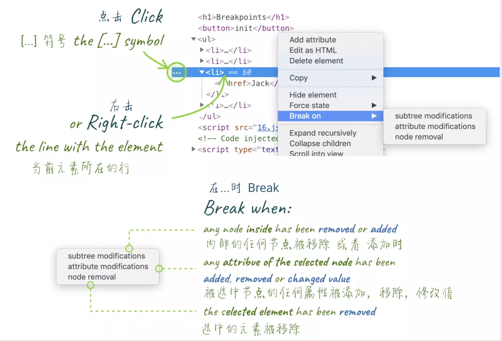
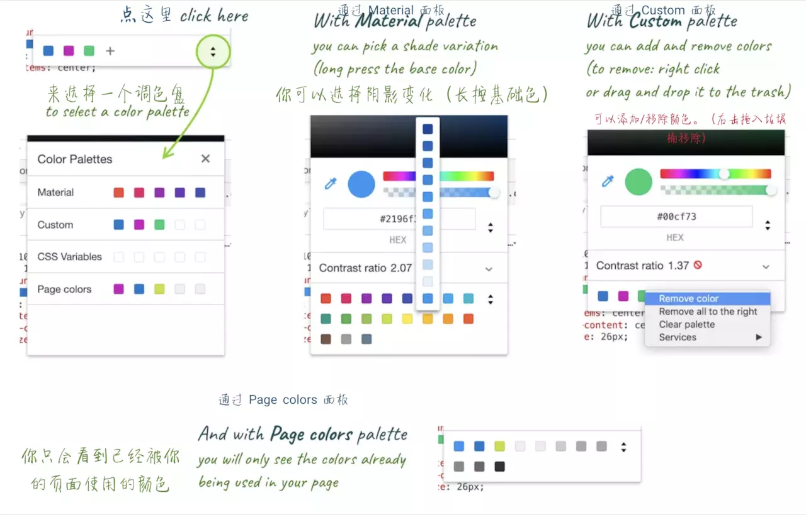

# 你不知道的Chrome调试技巧

## 通用篇 - copying & saving

- `copy`方法
- ~~Store as global~~
- 保存堆栈信息(`Save as...`)
- copy HTML(`Elements`选型卡中，右击`copy Element`或者直接`ctrl+c`)

## 通用篇 - 快捷键和通用技巧

- `ctrl + shift + D`切换devtools位置
- 数值递增递减  
  - `↑` `↓`键 1  
  - alt + `↑` `↓`键 .1  
  - shift+ `↑` `↓`键 10  
  - ctrl + `↑` `↓`键 100  

## 通用篇 - 使用 Command
- `ctrl + shift + p` `Run command`
- 截图(效果一般)
`capture`
- 切换主题
`theme`

## 通用篇 - 代码块的使用
`Sources`面板 - `snippets`，在`Sources`中运行，或`Run command`输入`!`再选择运行（删除默认的`>`）

## console 篇 - console 中的 '$'
- $0为当前选中节点的引用，$1~$4
- $ -> document.querySelector, $$ -> document.querySelectorAll
- $i('lodash') -> 使用npm资源（需安装Console Importer插件）

## console篇 - 对象&方法
- queryObjects(构造函数) -> 特定构造函数的所有实例
- monitor，monitorEvents监测方法或事件

## console其他方法
- `console.assert(assertion, obj1 [, obj2, ..., objN]);`assertion为falsy，则打印后面的信息
- `conole.table(array, array)`前一个为需要打印的值，后面一个限制打印对象的key
- `console.dir`有时需要打印的dom节点对应的js对象，而不是`Elements`中的节点
- `console.time(); console.timeEnd()`
- `Live expression`

## network
- 请求过滤

- 自定义请求table展示的字段
- `replay XHR`

## 元素面板篇 - 技巧集合
- 通过`h`隐藏元素
- 可拖动放置元素，ctrl+上下可以移动元素
- shadow editor/Timing function editor
- 展开元素所有子节点`expand recursively`
- DOM 断点`Break on`监听节点及节点内部的属性或元素变化

- 颜色选择器/对比度

## drawers

按`esc`进行切换

## workspace

将项目文件夹拖动到`Sources`中进行编辑，可以及时同步到文件及浏览器中

## 其他
google chrome developers - youtube

> 参考  
[你不知道的 Chrome 调试技巧 - 小册地址](https://juejin.im/book/5c526902e51d4543805ef35e/section/5c5269026fb9a049f1549e4a)
