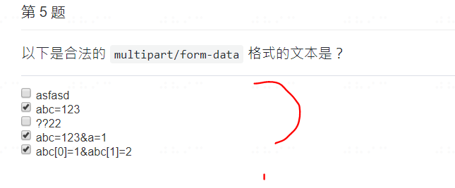

# 6. http server

content-type学习一下

nodemon -> 监听文件变化，重启node server

buffer -> 先统一分配内容空间存数据，自己再转换成各种格式

res.on('data') 可能运行多次  分片 65536，异步的方式写，不然会阻塞
res.on('end') -> data end

传文件mutlipart/form-data

request.url中不包括hash

?? form-data不是传文件的吗？

