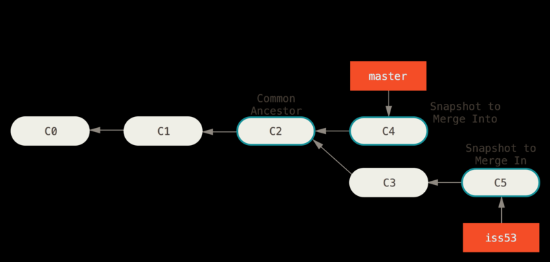

# 3.2-3.4 基本的分支操作

## 基本的分支和合并操作
### 基本的分支操作
```bash
# 新建分支
git branch <branch name>

# 切换到指定分支
# 切换分支需要保证工作目录与切换后的分支无冲突，切换后未提交的修改会出现在新的分支上
git checkout <branch name>

# 新建并切换到指定分支
git checkout -b <branch name>

# 删除分支
# 已并入其他分支的分支
git branch -d <branch name>
# 未并入其他分支的分支，强制删除
git branch -D <branch name>
```

### 基本的合并操作

如下图，假设此时在master分支，现运行`git merge iss53`，git会找到两个分支的最近一次commit(C4和C5)和两个分支的共同祖先(C2)，进行简单的三方合并，并创建一个新的commit



### 基本的合并冲突处理

解决后正常的git add + git commit即可


## 分支管理

```bash
# 查看本地分支
git branch
# 查看本地和远程分支
git branch -a
# 每个分支的最新commit
git branch -v

# 查看已并入当前分支的所有分支
git branch --merged
# ……未并入
git branch --no-merged
```
## 分支工作流

### 长期分支
可以构建出及格不同稳定性级别的分支，当分支达到更高的稳定程度时，就将其合并到更高级别的分支，如大型项目的功能迭代
