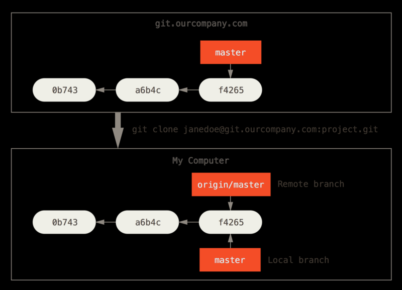
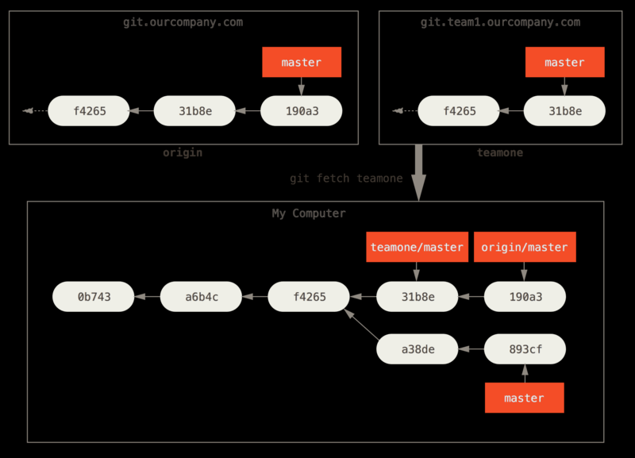

# 3.5 远程分支

`git clone` 时远程仓库的默认名称为origin，并拉取它的全部数据，然后会在本地常见指向服务器上master分支的指针，并命名为origin/master，如下图：远程分支也相当于一个指针



多个远程分支



## 跟踪远程分支

基于远程分支创建的本地分支会自动成为跟踪分支(tracking branch or upstream branch(上游分支))，即直接运行`git push` 或 `git pull`，git知道操作哪个远程分支

克隆仓库创建的本地分支也是跟踪分支

```bash
# 创建新分支作为某个远程分支的跟踪分支

# 创建-当执行分支切换操作时，没有-b并且有对应的远程分支时，git会自动帮你创建一个跟踪分支
git checkout serverfix
# 创建-如果远程分支和本地分支同名，以下两种效果一致
git checkout --track origin/serverfix
git checkout -b serverfix origin/serverfix
# 创建-checkout -b 可以命名不一样的分支名称
git checkout -b sf origin/serverfix

# 设置(修改)已有分支跟踪的远程分支
# -u === -set-upstream-to
# 当前分支追踪远程的serverfix分支
git branch -u origin/serverfix

# 查看本地分支及其跟踪的远程分支
git branch -vv
```

## 拉取

git fetch origin获取到远程新增的分支后，git并不会自动提供给你该分支的本地副本，可通过checkout创建或者merge合并到本地分支或者rebase……

```bash
# fetch只拉取，不操作
# pull若本地有跟踪分支，帮你合并
git pull = git fetch + git merge

# merge到当前分支
git merge origin/serverfix
# 创建远程分支对应的本地分支
git checkout -b serverfix origin/serverfix
```

## 推送

```bash
# 将本地的branch推送到remote同名branch分支
git push (remote) (branch)

# 本地的localBranch推动到远程的remoteBranch分支(branch名不同)
git push origin localBranch:remoteBranch
```

## 增删远程分支

```bash
# 新增远程分支
git remote add dev <git url>

# 删除远程分支origin/serverfix（一段时间内，误删可恢复）
git push origin --delete serverfix
```

## bash实例

### 设置(修改)已有分支跟踪的远程分支

```bash
# 本地分支dev track 远程的origin仓库的upgrade-dev
$ git branch -u origin/upgrade-dev
Branch dev set up to track remote branch upgrade-dev from origin.

# 注意：此对比为最近一次与远程交互时的对比，并非实时对比
# ahead commit未同步到远程
# behind commit未同步至本地
# master分支与远端是同步的
# test1 分支追踪远程的origin/upgrade-dev分支
$ git branch -vv
* test1            a5056952 [origin/upgrade-dev: ahead 3, behind 1] fix sth
  test2            cb0482e3 fix sth
  test3            32e9a5ef [origin/upgrade-dev: behind 138] fix sth
  test4            dee7308d fix sth
  master           d99edcfd [origin/master] fix sth

```

### 创建新分支跟踪远程
```bash
# 以下命令行没有先后顺序关系，只用来说明两者等价

$ git checkout --track origin/angular-dev
Switched to a new branch 'angular-dev'
Branch angular-dev set up to track remote branch angular-dev from origin.

$ git checkout -b angular-dev origin/angular-dev
Switched to a new branch 'angular-dev'
Branch angular-dev set up to track remote branch angular-dev from origin.
```
