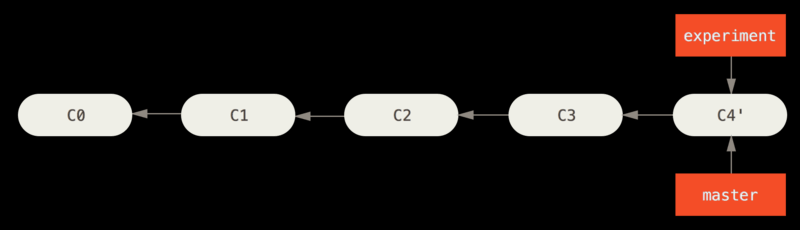
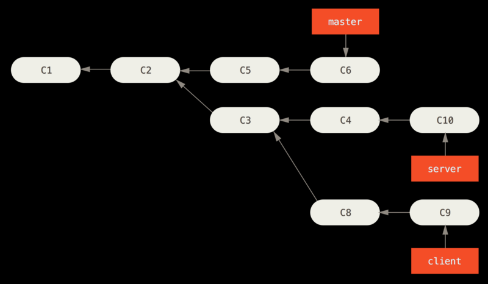
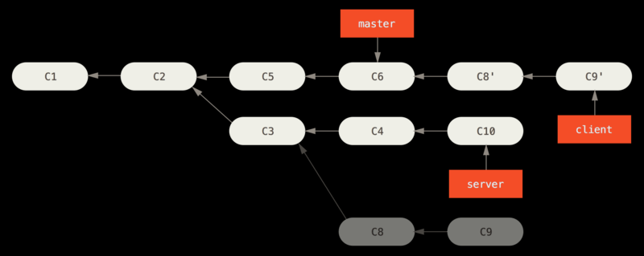

# 3.6 git rebase

:no_good:**永远不要对已提交到远程的commit使用**

::: danger  
guideline: **Do not rebase commits that exist outside your repository.**  
作者神吐槽：If you follow that guideline, you’ll be fine. If you don’t, people will hate you, and you’ll be scorned by friends and family.
:::

rebase的原理：找到两个要整合的分支(当前分支和要整合到的分支)的共同祖先，然后取得当前分支每次提交引入的diff，并将diff保存成临时文件，将当前分支重置为要整合到的分支，最后在该分支上一次引入之前保存的每个更改

rebase的commit和之前的commit只是内容相同，commit id为证

如果只有一个分支有改动，是不能使用rebase的，直接fast forward merge即可(因为都没有分叉啊，笨蛋)

## 基本的rebase

C4和C4'是不同的commit（commit id变了），只是内容相同

```bash
# 切换到experiment分支，再以master为基，将该分支的更改重现到master分支上，如下两张图
# = git checkout experiment + git rebase master
git rebase master experiment
```

初始仓库

执行git rebase master experiment



### bash实例

```bash
# 说明：web-dev为基础分支，web-dev-1为要被合并的分支，两个分支都只比公共祖先分支ahead一个commit

# 查看web-dev，f4b40956为最新commit
guidetheorient@URCUMQA MINGW64 /c/d/test/learn-git-2 (web-dev)
$ git lg -2
* f4b40956 - (HEAD -> web-dev) a-test1 
* dee7308d - fix($views) bugfix

# 查看web-dev-1分支commit信息
guidetheorient@URCUMQA MINGW64 /c/d/test/learn-git-2 (web-dev-1)
$ git co web-dev-1 && git lg -2
* 4db35349 - (HEAD -> web-dev-1) b-test1
* dee7308d - (web-dev) fix($views) bugfix 

# 执行rebase
guidetheorient@URCUMQA MINGW64 /c/d/test/learn-git-2 (web-dev)
$ git rebase web-dev web-dev-1
First, rewinding head to replay your work on top of it...
Applying: test

# 注意：执行完后分支自动切换到web-dev-1，所以rebase实际是针对被合并分支进行
# 并且此时web-dev-1 b-test1的commit id已经发生变化cc2361f6（现在） ！== 4db35349（原来）
guidetheorient@URCUMQA MINGW64 /c/d/test/learn-git-2 (web-dev-1)
$ git lg -2
* cc2361f6 - (HEAD -> web-dev-1) b-test1
* f4b40956 - (web-dev) a-test1
* dee7308d - *1187 fix($views) bugfix 

# 查看web-dev分支，发现没有变化
guidetheorient@URCUMQA MINGW64 /c/d/test/learn-git-2 (web-dev-1)
$ git co web-dev && git lg -2
Switched to branch 'web-dev'
* f4b40956 - (HEAD -> web-dev) a-test1
* dee7308d - *1187 fix($views) bugfix

# 此时web-dev和web-dev-1其实就是一条线上的两个分支，可以执行快速合并
# 这个其实针对于要将内容合到主分支的人需要操作的（仓库管理者），一般直接rebase到远程分支，再push就可以了
guidetheorient@URCUMQA MINGW64 /c/d/test/learn-git-2 (web-dev)
$ git merge web-dev-1
Updating f4b40956..cc2361f6
Fast-forward
 test.md                                                 |   1 +
 1 files changed, 1 insertions(+)
 create mode 100644 test.md

# 至此web-dev合并了web-dev-1的内容，并且保持了commit树是一条直线
guidetheorient@URCUMQA MINGW64 /c/d/test/learn-git-2 (web-dev)
$ git lg -3
* cc2361f6 - (HEAD -> web-dev, web-dev-1) b-test1
* f4b40956 - web-dev a-test1
* dee7308d - *1187 fix($views) bugfix 
```

## More Interesting Rebases
```
# 说人话，以master为基，将client分支相对于server分支独有的commit，patch到master上面
git rebase --onto master server client
```




## The Perils of Rebasing

目前公司是如下的操作，一般update后进行rebase可以避免迷之`push -f`，至于perils等遇到的时候再google

```
git remote update
git rebase remote/teamone
# 直接push到远程对应分支，就需要在本地执行fast forward merge了
git push origin <branch name>
```

## Rebase vs. Merge
follow you heart，取决于你想要怎样的提交历史，只是记住不要对提交到远程的commit执行rebase就好
