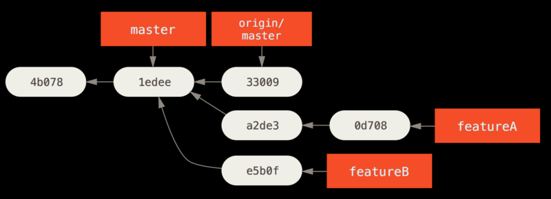

# 5.1 分布式工作流

:::tip 
第五章暂时用处不太大，主要关于仓库的管理，补丁的应用等工作过程，
:::

## 集中式工作流

一个仓库接受代码，所有人以此同步各自的工作。

## 集成管理者工作流

github

# 5.2 为项目做贡献

## 派生的项目

步骤(如下图)：
1. git clone项目仓库
2. fork仓库，并使用`git remote add myfork <url>`添加到clone的项目中
3. 新建一个feature分支，改动，并push到fork的仓库的其他新分支中`git push -u myfork feature`
4. pull request  
5. 新的feature从主仓库新建分支重新开始，`git chechout -b featureB origin/master`  

此时进行合并不会造成不同feature之间的干扰，如果远程分支已经有所前进，可以试着将分支rebase到origin/master的顶部

git format-patch -M origin/master

