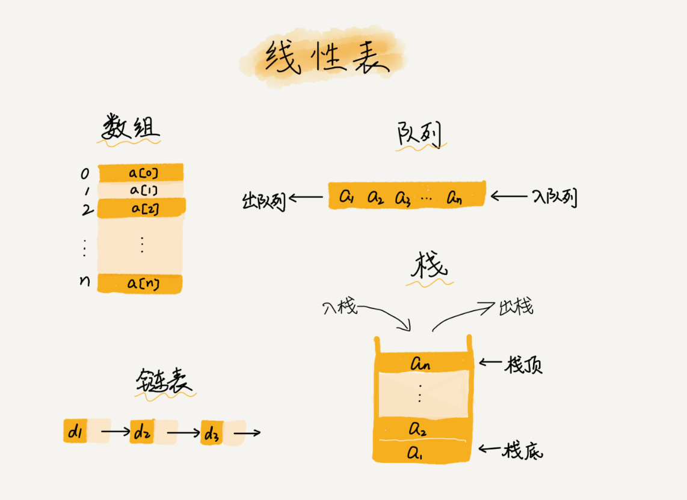
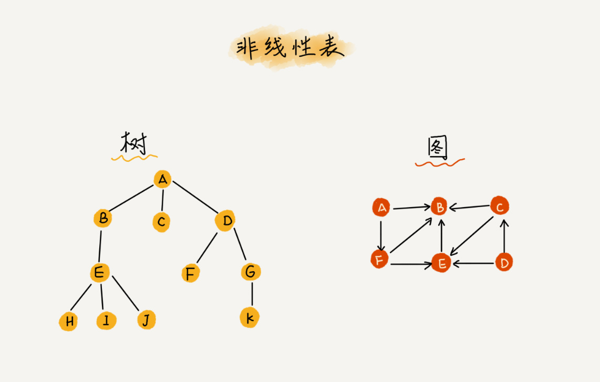

时间复杂度 -> 表示算法的执行时间与数据规模之间的变化趋势
空间复杂度 -> 表示算法的存储空间与数据规模之间的增长关系

[推荐书籍](https://time.geekbang.org/column/article/40681)
《算法帝国》

## 数据结构

### 数组

数组是一种线性表数据结构。他用一组连续的内存空间，来存储一组具有相同类型的数据。
数组最大的特点是支持随机下标访问，但插入，删除操作也因此变得更低效

线性表

非线性表

